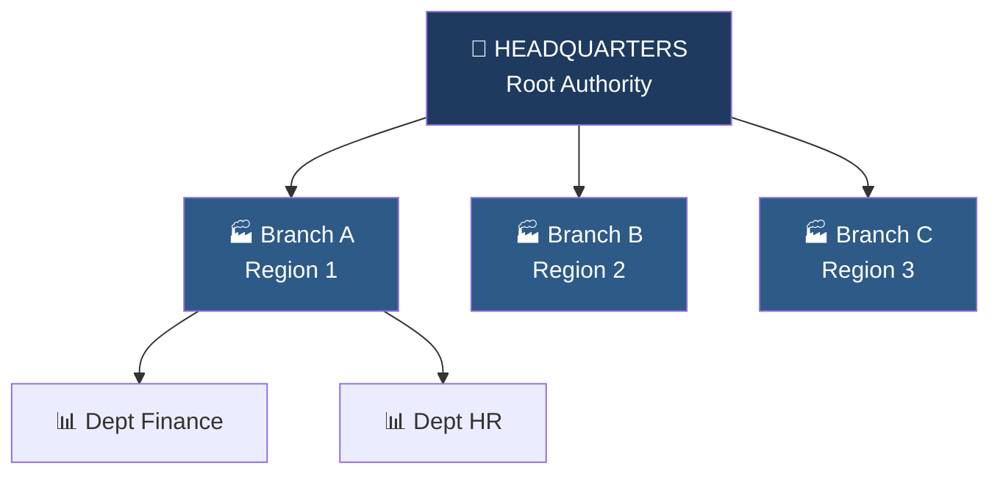
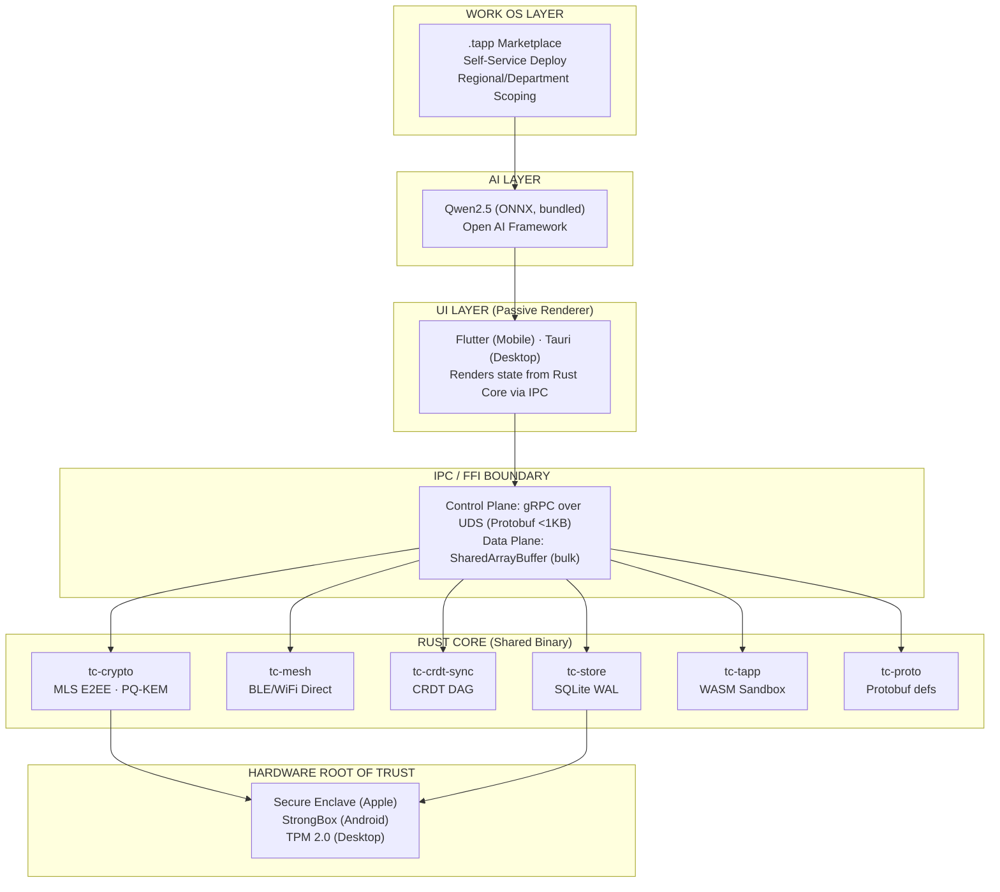
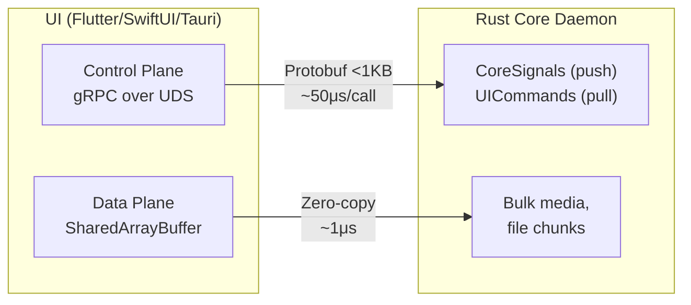
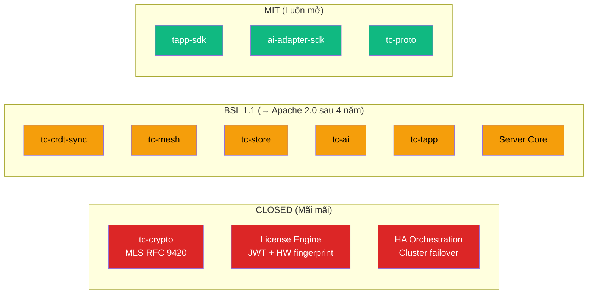
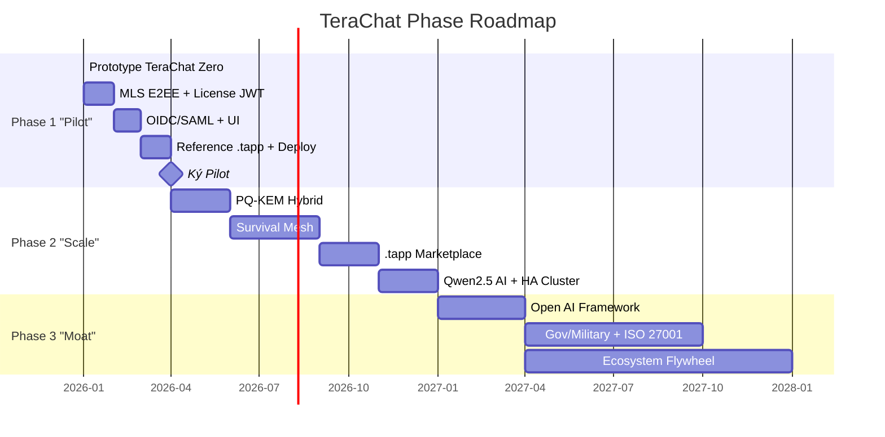

# TeraChat — Tổng quan Kiến trúc

> **Single Source of Truth** — Tài liệu tổng hợp toàn bộ kiến trúc TeraChat, phản ánh các quyết định mới nhất tính đến 2026-05-21.

---

## 1. Tầm nhìn Sản phẩm

TeraChat là **Enterprise Work OS** — KHÔNG phải ứng dụng nhắn tin. Đây là nền tảng vận hành doanh nghiệp nội bộ kết hợp messaging, .tapp mini-application, và AI cục bộ.

### Định nghĩa rõ ràng

| TeraChat LÀ | TeraChat KHÔNG LÀ |
|---|---|
| Nền tảng giao tiếp nội bộ doanh nghiệp + chi nhánh | Ứng dụng nhắn tin khách hàng |
| Work OS — business tasks chạy qua .tapp | Bản sao Slack/Teams |
| AI cục bộ (Qwen2.5 on-device) | Sản phẩm consumer / công khai |
| Zero-Knowledge, License-gated | SaaS đám mây phụ thuộc bên thứ ba |

### 4 hướng chiến lược mới

| Hướng | Mô tả |
|---|---|
| **BYO-Server** | Khách hàng tự mua phần cứng, TeraChat cung cấp phần mềm + license |
| **WorkOS / .tapp** | Hệ sinh thái mini-app WASM cho business workflow |
| **Local AI** | Qwen2.5 family mặc định, chạy 100% on-device |
| **Mesh** | TeraLink survival network (lấy cảm hứng từ BitChat) |

### Nguyên lý bất biến

1. **Zero-Knowledge Server** — TeraRelay là Blind Router, chỉ thấy `destination_device_id`, `blob_size`, `timestamp`. Không bao giờ thấy plaintext.
2. **Key Material không rời Chip** — Private key sinh ra và tồn tại vĩnh viễn trong Secure Enclave / StrongBox / TPM 2.0.
3. **Offline-First Survival** — BLE 5.0 + Wi-Fi Direct tạo mạng P2P khi mất Internet.
4. **Zero-Trust theo Thiết kế** — OPA Policy Engine enforce tại thiết bị, không chỉ tại server.
5. **License Entanglement** — `KDF(license_jwt, device_identity_key)` — sai license = key sai = database thành rác.

### Hierarchical Authority Messaging (lấy cảm hứng từ Google Allo)

Giao tiếp dựa trên **phân cấp quyền hạn tổ chức**, không phải kênh mở tự do:



| Luồng giao tiếp | Hỗ trợ | Phạm vi |
|---|---|---|
| Nhân viên ↔ Quản lý (cùng phòng) | ✅ | Department authority chain |
| Ngang hàng (cùng phòng) | ✅ | Department workspace |
| Phòng A → Phòng B (cùng chi nhánh) | ✅ | Branch workspace + authorization |
| Chi nhánh A → Chi nhánh B | ✅ | HQ-authorized inter-branch channel |
| Chi nhánh → Trụ sở | ✅ | Root authority channel |
| Nhân viên → Khách hàng | ❌ | **Ngoài phạm vi vĩnh viễn** |
| Truy cập công khai / ẩn danh | ❌ | Không hỗ trợ |

**Workspace authority:** Scope KHÔNG THỂ mở rộng sau khi tạo (immutable authority ceiling). Department head tạo workspace → scope = phòng + cấp dưới. HQ tạo workspace → scope có thể span nhiều chi nhánh.

---

## 2. Mô hình BYO-Server (Bring-Your-Own-Server)

### Triết lý

TeraChat **không ép mua phần cứng**. Khách hàng tự mua server, tự triển khai. TeraChat cung cấp:

- **Phần mềm:** TeraRelay single Rust binary (<20MB, 0 dependencies)
- **License:** JWT signed bởi HSM FIPS 140-3
- **Hỗ trợ:** Tùy theo tier

### License Tiers

| Tier | Phần cứng (khách tự mua) | NAS ECC | Giá/năm | Concurrent Users |
|---|---|---|---|---|
| **Starter** | 1× Mac Mini M4 Pro 24GB | Không bắt buộc | ~$900 | ≤50 |
| **Business** | 1-2× Mac Mini M4 Pro 48GB + NAS | Khuyến nghị | ~$3,600 | ≤200 |
| **Enterprise** | Cluster Mac + NAS ECC + Relay Node | **Bắt buộc** | ~$9,000 | ≤1,000 |
| **Gov/Military** | HPE Air-Gapped + HSM + NAS ECC | **Bắt buộc** | ~$15,000+ | Custom |

> **Invariant I-10 (NAS ECC) — CẬP NHẬT:** NAS ECC là **Tier-dependent**, không phải bắt buộc toàn cục. Starter tier có thể chạy không có NAS ECC. Enterprise và Gov/Military BẮT BUỘC NAS ECC. Lý do: SME không có ngân sách cho NAS ECC, nhưng Enterprise/Gov cần bảo vệ chống silent bit-flip trên WAL journal.

### Hardware Tier Details

| Tier | Compute Node | Storage Node | AI Node (optional) | Est. Hardware Cost |
|---|---|---|---|---|
| **Starter** | Mac mini M4 Pro 24GB (~$1,400) | Synology DS423+ 4TB ECC (~$600) | Mac mini M4 8GB + Ollama (~$600) | ~$2,000–2,600 |
| **Business** | 2× Mac mini M4 Pro 48GB HA (~$3,600) | Synology DS923+ 16TB ECC (~$1,200) | Mac Studio M2 Max 32GB (~$2,000) | ~$5,000–7,250 |
| **Enterprise** | 2× Mac mini M4 Pro 64GB + Mac Studio Ultra relay (~$8,000) | Synology RS2423+ 32TB ECC (~$2,500) | Mac Studio M2 Ultra 64GB (~$4,000) | ~$10,000–16,000 |
| **Gov/Military** | 2× HPE MicroServer Gen10+ ECC FIPS (~$8,000) | HPE MSA Storage ECC RAID (~$5,000) | On-device ONNX Phi-3-mini (~$6,000) | ~$25,000+ |

### Deployment Topologies

| Topology | Hạ tầng | Thời gian Setup | Use Case |
|---|---|---|---|
| **Self-Hosted Cloud** | VPS 512MB–8GB | 5–20 phút | SME, startup |
| **On-Premise** | Server nội bộ | 1–4 giờ | Enterprise, healthcare |
| **Air-Gapped** | Hardware offline | Nửa ngày | Gov, defense, banking |
| **Hybrid** | On-prem + cloud relay | 1 ngày | Tập đoàn đa chi nhánh |

### TeraRelay

```yaml
binary: terachat-relay
size: <20MB (compressed, static binary)
dependencies: none
platforms: [macOS arm64/x86_64, Ubuntu 22.04+, Debian 12+]
startup_time: <5 giây
memory_idle: <50MB
memory_100_users: <256MB
deploy_time: ≤30 phút (IT admin, không cần DevOps)
```

Deploy bằng 1 lệnh:

```bash
curl -fsSL https://install.terachat.io | sudo bash
```

Script tự động: detect OS → download binary → tạo system service → auto TLS → khởi tạo SQLite WAL → tải OPA policy → in ra URL admin console.

---

## 3. Kiến trúc Hệ thống

### System Layer Diagram



### ADR-001: Headless Daemon Architecture

**Status:** ACCEPTED — 2026-05-12

Rust Core chạy như **independent system service** (headless daemon). UI là pure rendering client kết nối qua gRPC/IPC.

| Platform | Daemon Form | Service Type |
|---|---|---|
| **macOS** | `launchd` agent | `com.terachat.core` LaunchAgent |
| **iOS** | App Extension + Foreground Service | NSE for push, App Group for state |
| **Android** | `ForegroundService` | Persistent notification (OEM-resistant) |
| **Windows** | Windows Service | `sc.exe` registered service |
| **Linux** | `systemd` unit | `terachat-core.service` |

**Lý do:** UI crash/update/restart không mất encrypted sessions. BLE mesh tiếp tục chạy khi app ở background. MLS epoch rotation xảy ra độc lập với UI state.

### ADR-002: Dual-Plane Sync (CRDT + Relational)

**Status:** ACCEPTED — 2026-05-12

Hai sync plane riêng biệt, hai database, ba merge strategy:

> **[Cập nhật v2.0 2026-05-30]** Chat messages dùng Append-Only Event Log + Vector Clocks (đưa ra trong ADR-002 updated). CRDT chỉ ở Collaborative Notes namespace.

| Plane | Data | Sync | Database | Merge |
|---|---|---|---|---|
| **Message Plane** | Chat messages, Presence, Reactions | **Append-Only Event Log + Vector Clocks** | `event_log.db` (SQLite WAL, append-only) | Tuyến tính theo Vector Clock — không xung đột |
| **CRDT Scope** | Collaborative Notes, Thread Titles | CRDT (giới hạn) | Namespace trong `event_log.db` | Tự động merge (LWW + causal) |
| **App State Sync** | Finance, HR, Structured | Vector-Clock Relational | `cold_state.db` (SQLite + SQLCipher AES-256) | Conflict detection, manual resolution |

- `event_log.db` là **APPEND-ONLY** — không UPDATE, không DELETE dòng gốc. Edit/Delete là override events mới.
- `cold_state.db` dùng **shadow DB atomic rename** cho schema migration.
- Content addressing: `BLAKE3(workspace_id || salt || chunk)` — chống cross-tenant dedup side-channel.
- UUID v7 time-ordered primary keys cho causal ordering.

### ADR-003: gRPC over FFI for IPC

**Status:** ACCEPTED — 2026-05-12



- **Control Plane:** gRPC (Protobuf over UDS) — single contract cho tất cả platforms, built-in versioning, server-streaming cho CoreSignals.
- **Data Plane:** SharedArrayBuffer / mapped memory — zero-copy media transfer cho bulk data.
- FFI chỉ dùng cho: Hardware Secure Enclave access, sub-microsecond operations.

### Deep Module Design

Nguyên tắc từ John Ousterhout: **simple interfaces, complex interiors.**

| Quy tắc | Enforcement |
|---|---|
| ≤5 pub items/module (khuyến nghị), ≤7 (CI hard limit) | CI gate `check_module_depth` |
| Interior ẩn hoàn toàn khỏi caller | Rust visibility modifiers |
| AI agent friendly — clear contract | Deep interface pattern |

```rust
// Ví dụ: InferenceGateway — 3 public methods, interior ẩn hoàn toàn
pub trait InferenceGateway: Send + Sync {
    async fn complete(&self, request: InferenceRequest)
        -> Result<InferenceResponse, InferenceError>;
    async fn stream(&self, request: InferenceRequest)
        -> Result<InferenceStream, InferenceError>;
    fn health(&self) -> GatewayHealth;
}
// Interior: thermal monitoring, scheduling — tất cả hidden.
```

---

## 4. Tech Stack

| Layer | Technology | Notes |
|---|---|---|
| **Core** | Rust 1.75.0 | ring, blake3, openmls, tokio, zeroize |
| **Protocol** | MLS RFC 9420 | QUIC/gRPC/WSS, ALPN negotiation |
| **Crypto** | AES-256-GCM | ML-KEM-768 (Phase 2+), Ed25519, Curve25519 |
| **Storage** | SQLite WAL + SQLCipher | BLAKE3 CAS, tenant-salted content addressing |
| **Mobile UI** | Flutter + Dart FFI | iOS, Android, Huawei HarmonyOS |
| **Desktop UI** | Tauri (Rust + WebView) | macOS, Windows, Linux |
| **WASM** | wasmtime (Desktop/Android) | wasm3 (iOS — W^X constraint, +15-20ms/call) |
| **AI** | **Qwen2.5** (default) | ONNX Runtime, CoreML export, MLX runtime |
| **Sync** | CRDT DAG + Vector-Clock | HLC timestamps, UUID v7 |
| **Identity** | OIDC/SAML | Google Workspace, Azure AD, Keycloak |
| **Policy** | OPA (Open Policy Agent) | ABAC, device-local enforcement |
| **IPC** | gRPC over UDS | Protobuf (tonic + prost), SharedArrayBuffer |
| **Monitoring** | Prometheus + Grafana + Loki | JSON structured logging |

### Domain Spec Map

| Spec ID | Domain | Owns |
|---|---|---|
| **TERA-CORE** | Crypto & Mesh | MLS, PQ-KEM, Hardware keys, Survival mesh |
| **TERA-SYNC** | Sync & Storage | CRDT DAG, relational sync, SQLite, Blob CAS |
| **TERA-RUNTIME** | WASM Runtime | .tapp sandbox, Host ABI, Event Bus, AI inference ABI |
| **TERA-ENCLAVE** | Secure Enclave | AI security, Qwen2.5, Open AI framework |
| **TERA-GOV** | Identity & Governance | DID, OPA, RBAC, SCIM, Audit trail, authority hierarchy |
| **TERA-CLIENT** | IPC & UI Bridge | FFI protocol, UI signals, streaming proxy |
| **TERA-ECO** | Ecosystem & Marketplace | .tapp PKI, Web Marketplace, self-service deploy, kill-switch |

---

## 5. Licensing & BSL Model

### 3-Tier Source Code Licensing



| Tier | Modules | Quy tắc |
|---|---|---|
| **CLOSED** | `tc-crypto`, License Engine, HA Orchestration | Không bao giờ public source. Binary distribution only. |
| **BSL 1.1** | `tc-crdt-sync`, `tc-mesh`, `tc-store`, `tc-ai`, `tc-tapp`, Server Core | Auto-convert → Apache 2.0 sau 4 năm. Competitive use clause cấm fork + rebrand. |
| **MIT** | `tapp-sdk`, `ai-adapter-sdk`, `tc-proto` | Mãi mãi mở. Community tự do fork, modify, distribute. |

**BSL Competitive Use Clause:** Cung cấp TeraChat-compatible messaging service cho third-party organization as a service = vi phạm. Self-deploy nội bộ, build .tapp, integrate AI adapter, academic research = được phép.

**Invariant I-13:** Module MIT hôm nay sẽ mãi mãi là MIT. CI gate `bsl-boundary-hash` enforce mỗi `git tag`.

### License JWT Mechanism

```
Organization → terachat.io → chọn tier → thanh toán qua web
    ↓
TeraChat cấp License JWT (HSM FIPS 140-3 signed)
  {tenant_id, domain, max_seats, tier, valid_until, features}
    ↓
IT Admin nhận JWT → deploy TeraRelay (1 binary, 1 lệnh)
    ↓
App validate JWT + entangle với DeviceIdentityKey via KDF
    ↓
Không có license hợp lệ → "Liên hệ IT Admin"
```

**Thanh toán CHỈ trên web (terachat.io).** App không có payment flow, checkout, hay billing page.

### License States

| State | Visual | User Impact | Grace Period |
|---|---|---|---|
| **Valid** | Green badge | Full access | — |
| **T-30** | Amber banner (Admin only) | Admin Console warning | 30 ngày |
| **T-0** (expired) | Amber lock | "Liên hệ IT Admin để gia hạn" | Grace bắt đầu |
| **T+90** | Red lock | "License hết hạn — không thể kết nối" | Grace hết |
| **Invalid** | Full screen charcoal lockout | "Thiết bị chưa được cấp phép" | — |

---

## 6. UI/UX — Lấy cảm hứng từ Google Allo

### Triết lý thiết kế

```
Security Visible    → Trạng thái bảo mật luôn hiển thị
Density Efficient   → Thông tin dense, không lãng phí
Zero Noise          → Không animation không cần thiết
Operational Clarity → Admin không cần manual
```

**Không dùng WhatsApp-style bubble chat.** Enterprise data-density-first: compact, information-first, security status always visible.

### Glassmorphism Design System

```css
backdrop-filter: blur(20px);
background: rgba(255, 255, 255, 0.08);
border: 1px solid rgba(255, 255, 255, 0.12);
box-shadow: 0 20px 60px rgba(0, 0, 0, 0.25);
```

### 3 Visual Modes

| Mode | Background | Glass Effect | Security Indicator | Khi nào |
|---|---|---|---|---|
| **Online (Glass)** | `rgba(255,255,255,0.08)` | Full blur (Tier A/B) | Blue `#24A1DE` | Online, hoạt động bình thường |
| **Mesh (Dark Navy Radar)** | `rgba(15,23,42,0.95)` / `#0F172A` | Full blur (Tier A/B) | Radar Pulse HUD | Mất Internet, P2P mesh active |
| **License Invalid (Red Alert)** | Solid charcoal `#1A1A2E` | None (Tier C) | Amber/Red warning | License hết hạn hoặc invalid |

### GPU Tier Ladder

| Tier | Blur | Background Opacity | Border | Shadow | Thiết bị |
|---|---|---|---|---|---|
| **A** (Full Glass) | 20px | 0.08 | 1px rgba(255,255,255,0.12) | 20px/60px | Desktop M1+, iPhone 12+ |
| **B** (Reduced) | 10px | 0.12 | 1px rgba(255,255,255,0.15) | 10px/30px | Older devices, thermal `.fair` |
| **C** (Solid Fallback) | 0px | 0.95 solid | 1px rgba(255,255,255,0.20) | 4px/12px | Thermal `.serious`/`.critical`, SECURE MEMORY PURGE |

Rust Core emit `GpuCapability { compositing_tier: u8 }` lúc init → UI chọn variant. Downgrade tự động khi thermal throttling.

### Typography

| Role | Font |
|---|---|
| Body | **Inter** |
| Code / Mono | **JetBrains Mono** |
| Display (headings) | System (platform-native) |

### Accent Colors

| State | Color |
|---|---|
| Online | `#24A1DE` |
| Warning | `#F59E0B` |
| Danger | `#EF4444` |
| Success | `#10B981` |

### Animation Timing

| Animation | Duration |
|---|---|
| Message send | 120ms |
| State change | 200ms |
| Security event | 350–500ms |
| License transition | 300ms |
| Mesh mode switch | 500ms |

### IPC Signal → UI Mapping (trích)

| CoreSignalType | Widget State | Visual Mode | Priority |
|---|---|---|---|
| `ONLINE_CONNECTED` | Green indicator + Online badge | Light Glass | SECURITY |
| `MESH_MODE_ACTIVE` | Radar Pulse HUD + Dark Navy bg | Mesh Dark Navy | SECURITY |
| `EMDP_ACTIVATED` | Emergency amber HUD + countdown | Emergency Amber | SECURITY |
| `E2EE_SESSION_ESTABLISHED` | Blue lock badge (solid) | Glass blue overlay | SECURITY |
| `LICENSE_WARNING_T30` | Amber banner top | Amber banner | HIGH |
| `LICENSE_INVALID` | Full screen charcoal lockout | Charcoal `#1A1A2E` | SECURITY |
| `MEMORY_PURGE_INITIATED` | "Secure Memory Purge" overlay | GPU Tier C forced + red | SECURITY |
| `GPU_TIER_DOWNGRADE` | Subtle blur reduction | Tier transition | HIGH |
| `AI_INFERENCE_STARTED` | Pulsing blue dot | No change | NORMAL |
| `TAPP_LOADED` | .tapp icon appears sidebar | No change | NORMAL |

Xem [[Glassmorphism design system]] để biết full signal-to-widget mapping (30+ signals).

---

## 7. Phase Roadmap

TeraChat phát triển theo **3 economic phases**. Mỗi phase có metric định lượng cứng — không đạt = không qua gate.

### Tổng quan



### Phase 1 — "Pilot" (3–6 tháng)

**Goal:** IT admin tại ngân hàng tier 2 deploy TeraChat buổi sáng, demo cho Board buổi chiều.

| Component | Requirement |
|---|---|
| **MLS E2EE Internal Messaging** | E2EE group chat, file transfer, epoch rotation. Authority hierarchy. |
| **License JWT + DeviceIdentityKey** | Revenue model foundation. Entanglement với device key. |
| **OIDC/SAML** | Google Workspace + Azure AD. SAML attributes → roles + authority. |
| **1 Reference .tapp** | Expense Approval — chứng minh Work OS concept, deploy <10 phút. |
| **TeraRelay** | 1 binary, 1 lệnh, ≤30 phút deploy. |

**KHÔNG có trong Phase 1:** Survival Mesh, PQ-KEM, HA Cluster, .tapp Marketplace, AI (Qwen2.5), Customer messaging (vĩnh viễn).

**Success Metrics:**

| # | Metric | Target |
|---|---|---|
| M1.1 | IT Admin deploy time | ≤30 phút, không cần hỗ trợ |
| M1.2 | Daily Active Users / pilot | ≥20 users, 14 ngày liên tục |
| M1.3 | Message delivery | 500+ messages, 0 loss |
| M1.4 | Uptime | ≥99.5% trong 30 ngày |
| M1.5 | Pilot conversion | ≥1 LOI signed |

### Phase 2 — "Scale" (6–18 tháng)

**Goal:** Pilots converted to ARR. Renew + Upsell.

| Component | Requirement |
|---|---|
| **PQ-KEM Hybrid** | ML-KEM-768 post-quantum key exchange |
| **TeraLink Survival Mesh** | BLE 5.0 + Wi-Fi Direct, EMDP, 3-tier fallback |
| **.tapp Web Marketplace** | Self-service browse → purchase → deploy. Payment trên web. |
| **Qwen2.5 Local AI** | On-device ONNX. Thread summarization, response drafting. |
| **Mac Mini HA Cluster** | 2-node Active-Passive, shared NAS, WAL replication |
| **Complete Admin Console** | SCIM 2.0, Remote Wipe, audit PDF + Ed25519 signatures |

**Success Metrics:**

| # | Metric | Target |
|---|---|---|
| M2.1 | Paying customers | ≥10 tổ chức |
| M2.2 | 90-day retention | ≥80% |
| M2.3 | MRR | ≥$15K |
| M2.4 | Mesh uptime | ≥95% delivery during 4h outage |
| M2.5 | .tapp marketplace | ≥5 vetted .tapps |
| M2.6 | AI usage | ≥30% users dùng AI ≥1 lần/tuần |

### Phase 3 — "Moat" (18+ tháng)

**Goal:** Long-term defensibility qua AI, marketplace lock-in, Gov/Military contracts.

| Component | Requirement |
|---|---|
| **Full Open AI Framework** | Multi-model registration, BYOK cloud proxy, LoRA fine-tuning |
| **ZK Memory Agent** | AI features không phá ZK invariant |
| **.tapp Marketplace (Full)** | Third-party publishers, 20% revenue share |
| **Gov/Military Tier** | Air-gapped, Shamir 3-of-5, Anti-Insider Key Ceremony, ISO 27001 |

**Success Metrics:**

| # | Metric | Target |
|---|---|---|
| M3.1 | Enterprise customers | ≥50 tổ chức |
| M3.2 | ARR | ≥$1M |
| M3.3 | Gov/Military contract | ≥1 signed |
| M3.4 | ISO 27001 | Certified |
| M3.5 | Platform uptime SLA | ≥99.99% |
| M3.6 | Annual churn | <5% |

### Vertical Slice Methodology

Mỗi slice cắt qua TẤT CẢ layers nhưng chỉ implement đủ cho MỘT use case cụ thể:

| Slice | Thời gian | Goal | Deliverable |
|---|---|---|---|
| **0: Foundation** | Week 1-2 | Repo compiles, CI green | Cargo workspace, proto scaffolding |
| **1: Hello E2EE** | Week 3-8 | Hai Mac gửi E2EE messages | MLS roundtrip test, no UI |
| **2: Relay + Persistence** | Week 9-14 | Messages qua relay binary | TeraRelay, event_log.db, license JWT |
| **3: macOS + iPhone UI** | Week 15-22 | Real devices chatting | Tauri macOS + Flutter iPhone |
| **4: HA + Mesh Failover** | Week 23-30 | Clustered Mac mini + BLE | Raft WAL replication, mesh EMDP |
| **5: .tapp Runtime MVP** | Week 31-38 | 3 first-party .tapps | WASM sandbox, Host ABI, fuel metering |
| **6: Local AI** | Week 39-46 | AI summarize | Qwen2.5 on-device, thermal |

**Nguyên tắc:** Một slice tại một thời điểm. Không parallel slices. Finish Slice N → demo → feedback → adjust Slice N+1.

---

## 8. Monorepo & Codebase Navigation

### Directory Tree Overview

```
TeraChat-Project/
├── .agents/                 # Multi-Agent Harness (LangGraph, commands, skills)
├── .context/                # AGENT_CONTEXT.md — entry point cho AI agents
├── .github/workflows/       # CI/CD: build, security scan, WASM parity
├── docs/
│   ├── wiki/                # ★ Obsidian vault — Wiki chính thức
│   │   ├── concepts/        #   ~30 kiến trúc, ADR, spec khái niệm
│   │   ├── entities/        #   Entity definitions
│   │   ├── sources/         #   Wiki-linked spec summaries
│   │   ├── syntheses/       #   Gap analysis, health checks
│   │   ├── index.md         #   Mục lục Wiki
│   │   └── invariants.md    #   13 architectural invariants
│   └── raw/MD/              #   Raw spec documents (14 files)
├── phase/                   # Vertical Slice execution map (18 tháng)
├── source/
│   ├── apps/
│   │   ├── Laptop/          #   macOS (Tauri), Windows, Linux
│   │   └── Phone/           #   iPhone (Flutter), Android, Huawei, Oppo
│   ├── core/                #   ★ RUST CORE — domain owner
│   │   ├── tc-crypto/       #   MLS E2EE, key management      [CLOSED]
│   │   ├── tc-mesh/         #   BLE/WiFi Direct mesh           [BSL 1.1]
│   │   ├── tc-crdt-sync/    #   CRDT DAG sync engine           [BSL 1.1]
│   │   ├── tc-store/        #   Dual-plane storage             [BSL 1.1]
│   │   ├── tc-tapp/         #   WASM sandbox runtime           [BSL 1.1]
│   │   ├── tc-proto/        #   Generated Protobuf code        [MIT]
│   │   └── proto/           #   7 gRPC service definitions
│   └── server/              #   Server deployment configs
├── tests/                   # Chaos, cross-platform e2e, FFI stress
├── CLAUDE.md                # Engineering guardrails (13 invariants)
└── CONTRIBUTING.md          # .tapp community guide
```

### 6 Rust Crates Summary

| Crate | Vai trò | Công nghệ | License |
|---|---|---|---|
| `tc-crypto` | MLS RFC 9420 E2EE, key management, FFI Token Protocol, ZeroizeOnDrop | openmls, ring, zeroize, subtle | **CLOSED** |
| `tc-mesh` | BLE 5.0 + Wi-Fi Direct P2P mesh, peer discovery, EMDP, TeraLink 3-tier | Bluetooth LE, mDNS, Wi-Fi Direct | BSL 1.1 |
| `tc-crdt-sync` | Event Log engine + CRDT namespace — append-only event log, Vector Clocks, CRDT chỉ cho notes/titles | sled, blake3, HLC | BSL 1.1 |
| `tc-store` | Dual-plane storage — event_log.db (Event Log + CRDT namespace) + cold_state.db (relational) | SQLite WAL, SQLCipher, rusqlite | BSL 1.1 |
| `tc-tapp` | WASM sandbox — dual-engine (wasmtime desktop + wasm3 iOS), fuel metering | wasmtime, wasm3 | BSL 1.1 |
| `tc-proto` | Generated Rust code từ Protobuf — 7 gRPC services | prost, tonic | **MIT** |

### Dependency Flow

```
TERA-CORE (no deps — foundation)
  ├→ TERA-SYNC
  │    ├→ TERA-RUNTIME (includes AI Host ABI)
  │    │    ├→ TERA-CLIENT
  │    │    └→ TERA-ECO (Web Marketplace)
  │    └→ TERA-GOV (authority hierarchy enforcement)
  │         ├→ TERA-RUNTIME
  │         ├→ TERA-ENCLAVE (Qwen2.5 + Open AI Framework)
  │         ├→ TERA-ECO
  │         └→ TERA-CLIENT
  └→ TERA-ENCLAVE
```

### Reading Order cho Developer mới

| Thứ tự | File | Tại sao |
|---|---|---|
| 1 | **Tài liệu này** (`00_Architecture_Overview.md`) | Bức tranh tổng thể |
| 2 | `concepts/zero-knowledge-architecture.md` | Blind router model |
| 3 | `concepts/survival-mesh-networking.md` | TeraLink 3-tier fallback |
| 4 | `concepts/crdt-dual-sync.md` | Dual-plane sync |
| 5 | `concepts/adr-001-headless-daemon-architecture.md` | Vì sao daemon tách khỏi UI |
| 6 | `concepts/hierarchical-authority-messaging.md` | Mô hình phân quyền giao tiếp |
| 7 | `source/core/proto/terachat.proto` | Hợp đồng dữ liệu 7 gRPC services |
| 8 | `source/core/tc-crypto/src/lib.rs` | Public API surface crypto |

**Thời gian ước tính:** 2–3 giờ đọc → bắt đầu contribute được.

### Navigation by Role

| Role | Read Order |
|---|---|
| Rust Core Dev | TERA-CORE → TERA-SYNC → TERA-RUNTIME |
| Frontend Dev | TERA-CLIENT only |
| .tapp Developer | TERA-RUNTIME → TERA-ECO |
| AI/ML Engineer | TERA-ENCLAVE → Open AI Framework |
| Security Auditor | TERA-CORE + TERA-GOV |
| System Architect | All 7 specs + tài liệu này |
| IT Admin | TERA-GOV + TERA-ECO |

---

## 9. Liên kết Wiki

| Trang | Mô tả |
|---|---|
| [[01_Mesh_and_Crypto]] | Chi tiết mật mã MLS, PQ-KEM, và Survival Mesh |
| [[02_WorkOS_and_Tapp_Ecosystem]] | Hệ sinh thái .tapp, WASM sandbox, Marketplace |
| [[03_Local_AI_Integration]] | Tích hợp Qwen2.5 cục bộ, Open AI Framework |
| [[Invariants]] | 13 quy tắc bất biến + enforcement mechanism |
| [[Ubiquitous Language]] | Bảng thuật ngữ chuẩn EN+VI |
| [[Glassmorphism design system]] | Full signal-to-widget mapping, GPU tiers |
| [[Enterprise license model]] | License JWT lifecycle, deployment tiers |
| [[Hardware specification]] | Node types, hardware tiers, ECC requirements |
| [[Hierarchical authority messaging]] | Authority-gated workspace, communication scope |
| [[Deep module design]] | ≤5 pub items/module, anti-patterns |
| [[Vertical slice development]] | Slice 0–6 timeline, progressive complexity |
| [[Phase framework]] | Economic milestones, gate metrics |
| [[Codebase directory guide]] | Full monorepo navigation, reading order |
| [[ADR-001 Headless daemon architecture]] | Daemon vs embedded library decision |
| [[ADR-002 Dual-plane sync]] | CRDT + Relational separation |
| [[ADR-003 gRPC over FFI IPC]] | Control Plane vs Data Plane |
| [[Vision redefinition 2026-05-11]] | Pivot từ messaging → Work OS |
| [[Narrowed phase 1 MVP]] | Scope reduction, 4 components only |
| [[Prototype-first model]] | TeraChat Zero, progressive complexity |
| [[Quantitative phase metrics]] | Hard KPIs per phase, validation gates |
| [[Deployment automation spec]] | Install script, health check, backup/recovery |
