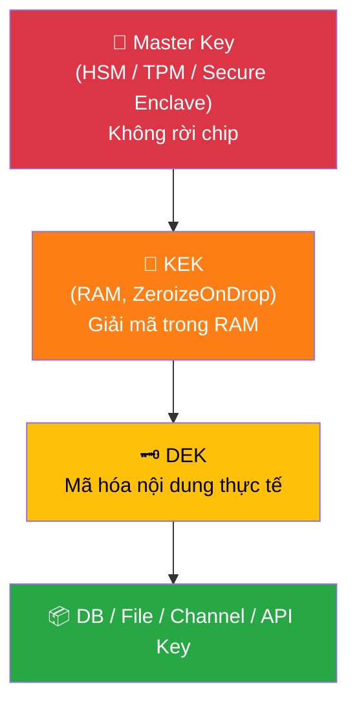
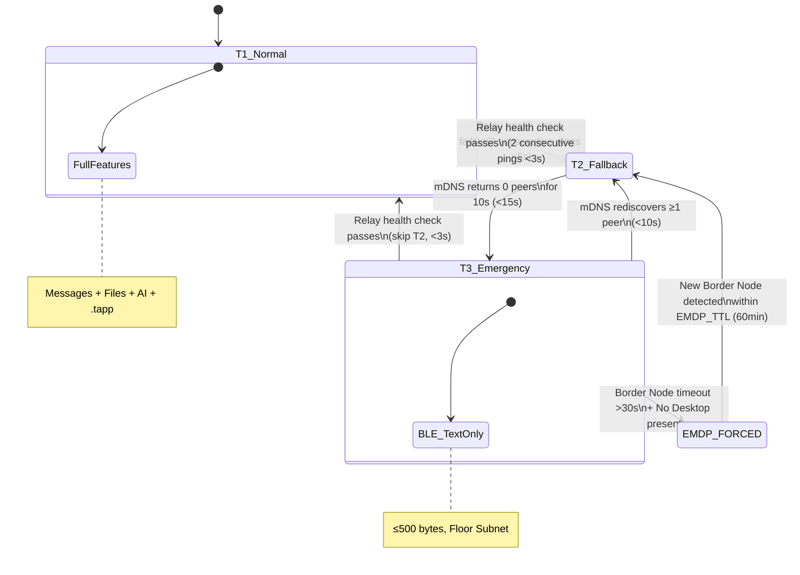

# TeraChat — Mật mã & Mạng lưới Mesh

> Tài liệu tham chiếu duy nhất (Single Source of Truth) cho toàn bộ kiến trúc mật mã học và mạng lưới mesh của TeraChat. Tổng hợp từ TERA-CORE spec, wiki concepts, và kết quả audit kĩ thuật từ Hội đồng Chuyên gia.

---

## 1. Kiến trúc Zero-Knowledge

TeraChat áp dụng mô hình **Blind Router** — server KHÔNG BAO GIỜ sở hữu plaintext hoặc decryption key. Đây là thuộc tính cấu trúc (structural property), không phải tùy chọn cấu hình.

```
Client Device                         TeraRelay (Blind Router)
─────────────                        ─────────────────────────
Encrypt(message, session_key)  ───→  Sees only:
                                     • destination_device_id
                                     • blob_size
                                     • timestamp
                                     Routes ciphertext blindly
```

### 4 Cơ chế Bảo đảm

| # | Cơ chế | Mô tả |
|---|--------|-------|
| 1 | **Key-in-Chip** | Private key sinh và lưu vĩnh viễn trong Secure Enclave (Apple) / StrongBox (Android) / TPM 2.0 (Desktop). Không có export path |
| 2 | **License Entanglement** | License JWT bound vào `DeviceIdentityKey` qua KDF — sai license = sai key = database thành garbage |
| 3 | **Blind Storage** | Mọi blob (file, media) mã hóa client-side. Server lưu ciphertext, không có symmetric key |
| 4 | **Streaming Decryption Proxy** | Media giải mã on-device, stream tới `127.0.0.1` loopback — không bao giờ ghi plaintext ra disk |

### 3 Trade-off Chấp nhận

| Trade-off | Hệ quả |
|-----------|--------|
| **No server-side search** | Full-text search phải dùng client-side FTS5 với ZK indexes — tốn tính toán trên device |
| **No admin plaintext access** | IT Admin không đọc được tin nhắn — cần Legal Hold + device cooperation |
| **No key recovery** | Mất toàn bộ device = mất dữ liệu vĩnh viễn. Không có backdoor |

### Sealed Sender & Traffic Analysis Mitigation

- **Sealed Sender:** Header người gửi mã hóa bằng public key người nhận — server không biết who-to-whom
- **Oblivious CAS Routing:** Batch 4–10 `Fake_CAS_Hashes` khi gửi hash query (Chaffing), tra qua Mixnet Proxy Endpoint
- **MinIO Blind Storage:** Lưu file theo `cas_hash` path — không biết tên file thực

---

## 2. Bộ Mật mã (Crypto Stack)

| Component | Library / Standard | Mục đích | Phase |
|-----------|-------------------|----------|-------|
| MLS RFC 9420 | `openmls` crate | E2EE group messaging, TreeKEM, epoch rotation | Phase 1 |
| Hybrid PQ-KEM | X25519 + ML-KEM-768 (Kyber768) | Post-quantum key exchange, CNSA 2.0 compliance | Phase 2+ (Gov/Military mandatory) |
| Primitives | `ring` / `RustCrypto` | Tất cả crypto primitives — **KHÔNG self-implement** (Invariant I-03) | Phase 1 |
| Hashing | BLAKE3 | Content-addressable storage, integrity check | Phase 1 |
| Signing | Ed25519 | Digital signature, audit trail, beacon validation | Phase 1 |
| Content Encryption | AES-256-GCM | Mã hóa nội dung message và file | Phase 1 |
| Database Encryption | SQLCipher | Mã hóa `cold_state.db` at rest | Phase 1 |
| Key Derivation | HKDF | Derive session key, push key, composite key | Phase 1 |
| Push Ratchet | OOB Symmetric | NSE isolation — `Push_Key` hash-chain một chiều, độc lập MLS TreeKEM | Phase 1 |

### Công thức Key Derivation quan trọng

```
# Hybrid PQ-KEM Session Key
Final_Session_Key = HKDF(X25519_Shared || Kyber768_Shared)

# Composite Key (Defense in Depth — chống Hardware Zero-Day)
Session_Key = KDF(Hardware_Secret || License_JWT_Entropy || User_PIN_or_Biometric)
```

> **WHY Composite Key:** Nếu chỉ dùng `DeviceIdentityKey` từ Secure Enclave/TPM → trust 100% vào một vendor hardware. Composite Key đảm bảo: dù TPM bị crack, attacker vẫn cần License entropy + user PIN để reconstruct key.

---

## 3. Phân cấp Khóa (Key Hierarchy)



### Domain: Cryptographic Identity

| Object | Type | Storage | Lifecycle |
|--------|------|---------|-----------|
| `DeviceIdentityKey` | Ed25519 Key Pair | Secure Enclave / StrongBox | Permanent (hardware-bound) |
| `Company_Key` | AES-256-GCM Root Key | HKMS (wrapped by DeviceKey) | Per-workspace, rotate on member exit |
| `Epoch_Key` | MLS Leaf Key | RAM (Userspace) | Per MLS Epoch, zeroized on rotation |
| `ChunkKey` | AES-256-GCM Ephemeral | `ZeroizeOnDrop` struct | 1 chunk (~2MB) lifetime |
| `Session_Key` | ECDH Curve25519 Derived | RAM (Userspace) | Per session, zeroized after disconnect |
| `Push_Key` | AES-256-GCM Symmetric | Shared Keychain (iOS) / StrongBox (Android) | Per push_epoch, OOB from MLS |
| `Master_Unlock_Key` | KDF output | RAM only (<100ms) | Duration of license validation |
| `Enterprise_Escrow_Key` | Shamir-split AES-256 | M-of-N hardware tokens | Per KMS bootstrap (3-of-5 Shamir) |

### Hardware Root of Trust (Tier-dependent)

| Platform | Cơ chế | Tier |
|----------|--------|------|
| 📱 Apple (iOS/macOS) | Secure Enclave (SEP) | All tiers |
| 📱 Android | StrongBox / TEE Keymaster | All tiers |
| 💻 Desktop (Windows/Linux) | TPM 2.0 | **Enterprise/Gov: bắt buộc** · SME: optional |
| 🗄️ Gov-Grade | HSM PKCS#11 (SafeNet/Viettel/VNPT CA) | Gov/Military only |

> **Invariant I-04:** `ZeroizeOnDrop` bắt buộc trên MỌI struct chứa key material. iOS không hỗ trợ `mlock()` → dùng Continuous XOR RAM Masking (nonce rotation mỗi 100ms).

### KMS Bootstrap Ritual

1. Workspace khởi tạo → App sinh `terachat_master_<domain>.terakey` (Master Key bọc AES-256 bằng Argon2id)
2. Rust Core **BLOCK** tạo database cho đến khi Admin xác nhận lưu Key Backup
3. **Shamir 3-of-5** phân phát vào YubiKey/Smartcard của C-Level
4. HSM Decrementing Monotonic Counter: mỗi lần issue cert → counter giảm → chống cloning

> [!WARNING]
> **Key Rotation Recovery Gap:** Chưa có recovery protocol nếu 3/5 C-level mất YubiKey cùng lúc. Lagrange Interpolation yêu cầu tối thiểu 3 shards — nếu đồng thời mất 3 shards, không thể reconstruct Master Key. Cần: (1) Geographic shard distribution policy, (2) Offline backup shard trong safe deposit box, (3) Time-delayed emergency recovery ceremony.

---

## 4. Mô hình Đe dọa (Threat Model)

### Attack Vector 1: TeraRelay Compromise

Kẻ tấn công đã chiếm root trên TeraRelay server. Relay là blind router — câu hỏi: attacker thấy gì và làm được gì?

| STRIDE | Threat | Severity | Mitigation | Control |
|--------|--------|----------|------------|---------|
| **S**poofing | Impersonate relay | Critical | mTLS + cert pinning trong client binary | `tc-crypto` cert pinning |
| **T**ampering | Modify ciphertext | Critical | TLS 1.3 + MLS AEAD integrity | MLS end-to-end |
| **R**epudiation | Replay valid messages | High | MLS epoch counters, monotonic sequence | `openmls` epoch validation |
| **I**nfo Disclosure | Read relay disk/memory | Medium | ALL data = MLS ciphertext — zero plaintext | Blind Router architecture |
| **D**oS | Flood connections | Medium | Rate limiting per `DeviceIdentity`, WAF | `tc-relay` rate limiter |
| **E**levation | Pivot to client devices | None | Relay has NO key material, NO credentials | Zero-Knowledge |

### Attack Vector 1B: BLE Mesh Identity Spoofing (TeraLink T3)

Khi TeraLink ở T3 (BLE emergency) — attacker là thiết bị giả mạo trong cùng không gian vật lý:

| Threat | Severity | Mitigation |
|--------|----------|------------|
| Rogue BLE peer impersonation | **HIGH** | Full 32-byte Ed25519 fingerprint (NOT 8-byte truncated hash). Challenge-response trước khi accept peer |
| Brute-force identity commitment | **HIGH** (offline) | Full 32-byte thay 8-byte → chi phí: +2–3s latency peer discovery — chấp nhận được |
| Replay attack on mesh | Medium | HLC timestamp + CRDT dedup |
| Metadata correlation | Low-Medium | Sealed Sender + BLE padding + timing obfuscation |
| Sybil attack (fake node flood) | Medium | Enterprise CA-signed `Shun_Records`, identity quorum |

### Attack Vector 2: Device Compromise (Insider Threat)

| STRIDE | Threat | Severity | Mitigation |
|--------|--------|----------|------------|
| **S**poofing | Clone device identity | Critical | `DeviceIdentityKey` in SE/TPM — cannot export; key attestation at enrollment |
| **T**ampering | Modify local database | High | SQLCipher encryption via `KDF(license_jwt, device_identity_key)` |
| **R**epudiation | Deny sending message | High | Ed25519 signature on every message; immutable audit trail |
| **I**nfo Disclosure | Extract key from memory | Critical | `ZeroizeOnDrop`, SE sealed keys |
| **D**oS | Fill device storage | Low | Per-device quota, LRU eviction on iOS |
| **E**levation | User → Admin escalation | Critical | OPA RBAC engine, admin actions require quorum |

### Attack Vector 3: .tapp WASM Sandbox Escape

| STRIDE | Threat | Severity | Mitigation |
|--------|--------|----------|------------|
| **S**poofing | Impersonate system component | Critical | WASM sandbox + app signing PKI + manifest hash verification |
| **T**ampering | Modify another .tapp's state | Critical | DataGrant cryptographic isolation, per-.tapp namespace |
| **I**nfo Disclosure | Read cross-tenant data | Critical | DataGrant quorum protocol (GAP-E), explicit cryptographic grant |
| **D**oS | Exhaust fuel budget | High | Fuel metering (instruction count), memory <50MB per .tapp |
| **E**levation | Gain network access | Critical | `network:external` **PERMANENTLY BLOCKED** — no negotiation |

### Hybrid PQ-KEM Strategy (Post-Quantum Readiness)

| Segment | PQ Cần? | Lý do | Timeline |
|---------|---------|-------|----------|
| Enterprise Standard (Finance, Healthcare) | Chưa | Data shelf-life <5 năm; quantum risk chưa đủ justify chi phí | Phase 3+ per demand |
| Gov/Military | **BẮT BUỘC** | Strategic data shelf-life 10–20 năm. Store Now, Decrypt Later là real threat | Phase 2A |

**Per-tier deployment:**
- **Enterprise Standard:** X25519 only — PQ disabled mặc định, bật theo yêu cầu
- **Gov/Military:** Hybrid KEM bật mặc định, không thể tắt — ghi vào License JWT
- **EMDP Key Escrow:** Upgrade từ ECIES/Curve25519 thuần sang Hybrid ECIES + ML-KEM-768

---

## 5. TeraLink — Mạng lưới Mesh 3 Tầng (BitChat-inspired)

> TeraLink **thay thế hoàn toàn** khái niệm "Survival Mesh Networking" cũ. BLE chỉ là T3 emergency, không phải toàn bộ fallback strategy. Lấy cảm hứng từ BitChat cho mesh topology và peer discovery model.

### 5.1 Kiến trúc 3 Tầng

```
┌─────────────────────────────────────────────────────────────┐
│ T1: LAN / Wi-Fi (Normal Operation)                          │
│   Devices → TeraRelay (Compute Node) → NAS ECC Storage      │
│   Full features: messages, files, AI, .tapp                  │
│   Detection: Relay health check green                        │
├─────────────────────────────────────────────────────────────┤
│ T2: mDNS / Multipeer (Server Down)                          │
│   Devices discover each other via mDNS (macOS) or            │
│   MultipeerConnectivity (iOS)                                │
│   Text messages + presence only                              │
│   Detection: Relay health check fails (3 consecutive <5s)    │
├─────────────────────────────────────────────────────────────┤
│ T3: BLE Emergency (No LAN / No Wi-Fi)                       │
│   BLE 5.0 Coded PHY, ~200m range                             │
│   Text only, ≤ 500 bytes per message (Invariant I-11)        │
│   Floor Subnet Architecture: ≤ 50 devices per subnet         │
│   Detection: mDNS/Multipeer returns 0 peers for 10s          │
└─────────────────────────────────────────────────────────────┘
```

### 5.2 State Machine Chuyển tầng



| Transition | Trigger | Detection Time | Impact |
|-----------|---------|---------------|--------|
| T1 → T2 | Relay health check fails (3 consecutive) | <5s | Text only, no files/media, no AI |
| T2 → T3 | mDNS discovery returns 0 peers for 10s | <15s | BLE text only, 500-byte limit |
| T2 → T1 | Relay health check passes (2 consecutive) | <3s | Full feature restore |
| T3 → T2 | mDNS rediscovers ≥1 peer | <10s | Text + presence restored |
| T3 → T1 | Relay health check passes | <3s | Full feature restore (skip T2) |

### 5.3 EMDP (Emergency Mesh Data Protection)

Khi tất cả internet paths fail và Border Node mất:
- EMDP kích hoạt tự động <30s
- **60-min TTL** — hết hạn → yêu cầu reconnect Border Node
- **Epoch Freeze:** MLS `Update_Path` được prepared nhưng `Epoch_Ratchet` KHÔNG advance cho messages trong Tactical Relay buffer (Invariant CRIT-04)
- Key Escrow: iOS pin cao nhất nhận `EmdpKeyEscrow` từ peer cuối cùng có session key
- `EmdpKeyEscrow` phải dùng **Hybrid ECIES + ML-KEM-768** (không chấp nhận Curve25519 thuần — chống quantum harvest)

### 5.4 Floor Subnet Architecture

```
Floor 3:  [Device] [Device] [Device] ── Floor Gateway 3 ──┐
Floor 2:  [Device] [Device] [Device] ── Floor Gateway 2 ──┼── Backbone LAN
Floor 1:  [Device] [Device] [Device] ── Floor Gateway 1 ──┘
```

| Rule | Giá trị |
|------|---------|
| Max devices per BLE subnet | ≤50 |
| TTL trong mỗi subnet | 2 (ngăn broadcast storm) |
| Floor Gateway election | Highest uptime + strongest BLE signal |
| Floor Gateway hardware | Raspberry Pi 4 Model B 8GB (~$150–200) |
| **iOS devices** | `election_weight = 0` — **KHÔNG BAO GIỜ** làm Floor Gateway |
| iOS relay khi screen off | Không (background BLE restriction) |

### 5.5 Unified Transport Abstraction

```rust
trait MeshTransport: Send + Sync {
    async fn send(&self, peer: &PeerId, payload: &[u8]) -> Result<()>;
    async fn recv(&self) -> Result<(PeerId, Vec<u8>)>;
    fn estimated_throughput_kbps(&self) -> u32;
}

// WifiDirectTransport impl MeshTransport  (T2, <60m)
// BleRelayTransport impl MeshTransport    (T3, multi-hop)
```

MLS E2EE và CRDT sync layer gọi vào `MeshTransport` mà không cần biết transport phía dưới — Deep Module principle.

### 5.6 BLE QoS — Priority Multiplexer

| Priority | Tag | Traffic Type |
|----------|-----|-------------|
| **P0 — Critical** | `0x00` | MLS Handshake, Epoch Ratchet, `DataGrantRevoked`, `KillDirective`, `EmdpSessionTerminated` |
| **P1 — Standard** | `0x01` | Text `CRDT_Event`, Presence updates |
| **P2 — Bulk** | `0x02` | File chunks, Binary update gossip |

**Dynamic Backpressure:** RTT >200ms (congestion) → P2 **SUSPEND ngay lập tức**. P2 resume khi RTT <100ms sustained 5s.

### 5.7 RAM Budget Khi TeraLink Active

| Component | RAM Budget | Status |
|-----------|-----------|--------|
| BLE GATT stack + Control Plane | ~5 MB | Active — bắt buộc |
| MLS session state (group keys) | ~10–20 MB | Active — cached per group |
| CRDT `hot_dag` delta buffer | ~20–50 MB | Active — theo giới hạn device |
| Wi-Fi Direct / Multipeer session | ~15–30 MB | On-demand — foreground only |
| WASM .tapp sandbox | **0 MB** | ⛔ **SUSPEND hoàn toàn** |
| AI model | **0 MB** | ⛔ **KHÔNG load** |
| **Tổng target** | **<120 MB** | An toàn khỏi Jetsam threshold |

> [!IMPORTANT]
> WASM .tapp và AI inference **PHẢI** bị suspend khi TeraLink mode active. UI thông báo: *"TeraLink mode đang hoạt động — một số tính năng tạm thời không khả dụng."*

### 5.8 Platform-Specific Implementation

| Platform | T2 Discovery | T3 BLE | Notes |
|----------|-------------|--------|-------|
| **macOS** | mDNS (Bonjour) + TCP | CoreBluetooth | Full BLE central + peripheral |
| **iOS** | MultipeerConnectivity | CoreBluetooth | No relay khi screen off, `election_weight = 0` |
| **Android** | NSD | BluetoothLe | Foreground service required cho BLE |
| **Windows** | mDNS (native) | WinRT BLE | Limited peripheral mode |
| **Linux** | Avahi mDNS | BlueZ | Depends on hardware BLE support |

### 5.9 iOS Mesh Storage Tiers

| Tier | Device Class | Max Buffer | Content Allowed |
|------|-------------|------------|-----------------|
| Minimal | iPhone 12/13 (4GB) | 32MB | Text only |
| Standard | iPhone 14/15 (6–8GB) | 64MB | Text + small files (<5MB) + voice |
| Enhanced | iPad Pro (8–16GB) | 128MB | Text + media + voice |
| Full | Mac mini (32GB+) | 2GB | Everything (relay capability) |

Eviction policy: LRU with priority protection — critical messages never evicted. Eviction triggers at 90% capacity, targets 80%.

---

## 6. Xử lý BLE vs PQ-KEM (Audit Fix — Review F)

### Vấn đề

- BLE MTU thực tế: **~500 bytes** (Invariant I-11: `[u8; 500]`)
- Kyber768 Ciphertext: **~1100 bytes**
- → Không thể gửi PQ-KEM handshake trong 1 BLE packet

### Giải pháp: BLE GATT Streaming Reassembly

Chia Kyber768 ciphertext thành **3 frames** với simple sequence counter:

```rust
pub struct EmdpKeyEscrow {
    session_key_ciphertext: HybridKemCiphertext, // ECIES(X25519) || ML-KEM-768
    hlc: HLCTimestamp,
    issuer_sig: Ed25519Sig,

    // BLE GATT Streaming metadata
    fragment_index: u8,     // 0, 1, 2
    fragment_total: u8,     // 3
}
```

| Thuộc tính | Giá trị |
|-----------|---------|
| Priority | **P1** |
| Phase | 2A |
| Thay thế | RaptorQ FEC (bị loại — quá tốn pin) |
| CI Test (SC-38) | Inject BLE congestion (100kbps + 250ms RTT), assert `EmdpSessionTerminated` delivered <2s |

> **Invariant:** `EmdpKeyEscrow` với `session_key_ciphertext` non-hybrid (Curve25519 only) phải bị **REJECT** tại ingress sau upgrade.

---

## 7. Phòng chống Clock Rollback (Audit Fix — Review C)

### Vấn đề

- `DataGrantRevoked` TTL, EMDP Session TTL (60min), Burner Agent TTL đều phụ thuộc `SystemTime::now()`
- Khi Offline (Mesh mode), không có NTP sync
- Attacker xóa `cold_state.db` hoặc chỉnh lùi OS clock → bypass TTL vĩnh viễn

### Giải pháp Tier-dependent

| Tier | Cơ chế | Mô tả |
|------|--------|-------|
| **SME (Starter)** | Fail-Secure Fallback | Phát hiện DB wipe → `TAMPERED` state → Admin phải phê duyệt lại thiết bị. Không yêu cầu hardware đặc biệt |
| **Enterprise** | Hardware Monotonic Counter (TPM 2.0) | TPM counter không thể reset ngay cả khi battery pull. `Counter < Server's Last Valid Counter` → reject + self-destruct |
| **Gov/Military** | HSM Decrementing Monotonic Counter + Dead Man Switch | Mỗi unlock DB → Counter++. `Counter < Server's Value` → từ chối + self-destruct. Offline Grace: 720h max |

```rust
pub fn secure_elapsed_ms(anchor: &AnchorTime) -> u64 {
    let now_ticks = hardware_monotonic_ticks(); // mach_absolute_time / TSC / TPM
    let elapsed_ticks = now_ticks.saturating_sub(anchor.monotonic_ticks_at_sync);
    (elapsed_ticks * 1000) / anchor.tick_frequency_hz
}

// Hard rule: clock rollback detected → force-expire ALL active TTL policies
if system_time_now() < anchor.ntp_unix_sec {
    emit(CoreSignal::ClockTamperingDetected);
    force_expire_all_ttl_policies(); // Fail-secure
}
```

---

## 8. Kết quả Audit & Lộ trình Sửa lỗi

> Nguồn: Báo cáo kiểm toán từ Hội đồng Chuyên gia (Applied Cryptographer, Enterprise CTO, Distributed Systems Architect)

### 8.1 Tổng hợp Review

| Review | Claim | Verdict | Priority | Action |
|--------|-------|---------|----------|--------|
| **A.** mls_roundtrip test | Không test nào pass — nền tảng chưa validate | ✅ Correct | **P0** | Viết Integration Test E2EE ngay. Cryptography không có prototype: nó hoặc an toàn, hoặc bị phá vỡ |
| **B.** AI vào tc-crypto | LangGraph AI can thiệp tc-crypto = rủi ro bảo mật | ✅ Correct | **P0** | Lock `CODEOWNERS` — AI **KHÔNG ĐƯỢC** chạm `source/core/tc-crypto/` |
| **C.** Clock Rollback / TPM | Bắt buộc TPM/SE cho mọi tier | ⚠️ Partial | **P1** | Tier-dependent (xem §7). SME: Fail-Secure fallback. Enterprise/Gov: TPM bắt buộc |
| **D.** MLS TreeKEM 5000 users | 1200 payloads/s làm sập TeraRelay | ❌ Incorrect | **P3** | **Ignore.** Rust epoll/io_uring trên Mac Mini + Gigabit LAN xử lý 1200 packets <ms. Thiên kiến Cloud-SaaS |
| **E.** NAS ECC (Invariant I-10) | Starter dùng Mac Mini trực tiếp vi phạm I-10 | ⚠️ Partial | **P2** | Tier-dependent: I-10 updated — SME optional, Enterprise/Gov mandatory |
| **F.** BLE vs Kyber768 | BLE 500 bytes xung đột với Kyber768 1100 bytes | ✅ Correct | **P1** | BLE GATT Streaming 3-frame reassembly (xem §6) |

### 8.2 Executive Verdict

| Metric | Score |
|--------|-------|
| Technical soundness | 85/100 — Phân tích mật mã và bộ nhớ rất sắc sảo |
| Business alignment | 60/100 — Áp đặt chuẩn quân đội cho toàn bộ tệp khách hàng |
| Enterprise practicality | 70/100 — Bỏ qua yếu tố mạng LAN nội bộ |
| Risk realism | 75/100 — Xu hướng phóng đại rủi ro hệ thống mạng |

**Final Decision:** Audit technically correct but context-biased. Phản biện của CPO/Consultant kéo audit về thực tại kinh doanh B2B.

### 8.3 Lộ trình Hành động

| Timeframe | Action | Priority |
|-----------|--------|----------|
| **Immediate (1–2 weeks)** | Viết + pass Integration Test `mls_roundtrip` | P0 |
| | Cập nhật `.github/CODEOWNERS` — lock AI khỏi tc-crypto | P0 |
| | Quyết định xóa FFI Control Plane → 100% gRPC (UDS) | P1 |
| **Mid-term (1–3 months)** | Phân tách I-10 (NAS ECC) và TPM thành Tier-dependent | P2 |
| | Triển khai BLE GATT Streaming Reassembly cho PQ-KEM | P1 |
| | Vá Clock Rollback logic theo Fail-Secure | P1 |
| **Long-term (6–12 months)** | Xây dựng `tc-chaos` — Chaos Engineering suite | P2 |
| | Triển khai Snapshot/Truncate cho CRDT trên mobile | P2 |

---

## 9. Rủi ro Chưa được Thảo luận

> [!CAUTION]
> 3 rủi ro sau đây chưa được đề cập trong bất kỳ audit nào — cần spec bổ sung.

### 9.1 Mesh Battery Drain

**Vấn đề:** BLE GATT streaming cho KEM payload + CRDT sync liên tục → thiết bị di động (đặc biệt iOS) tuột pin cực nhanh. iOS Jetsam có thể kill process nếu thermal state critical.

**Cần:** Battery Budget spec song song với Thermal Budget hiện có. Bao gồm:
- Max BLE transmit duty cycle per 15-min window
- CRDT sync interval throttling khi pin <20%
- Automatic mesh role demotion (active → passive) khi pin <10%

### 9.2 Event Log State Management (cũ: CRDT State Bloat)

> **[Cập nhật v2.0]** Chat messages dùng Append-Only Event Log (đã thay thế CRDT DAG). `hot_dag.db` → `event_log.db`. CRDT chỉ ở namespace `notes.*`.

**Riủi ro còn lại:** CRDT namespace (`notes.*`, `thread.title.*`) trên Edge nodes vẫn có thể phình to theo thời gian. Tombstone GC là bắt buộc.

**Cần:** Snapshot/Truncate cơ chế định kỳ trên CRDT namespace:
- Desktop Super Peer tạo CRDT namespace snapshot (checkpoint)
- Mobile devices truncate CRDT data trước checkpoint (không phải event_log.db)
- Event Log được kiểm soát bằng 7-Day Sliding Window và WAL checkpoint định kỳ

### 9.3 Key Rotation Ceremony Recovery

**Vấn đề:** Shamir 3-of-5 quy trình chưa tính đến kịch bản đội IT thiếu kỹ năng. Nếu 3/5 C-level mất YubiKey cùng lúc → **không thể reconstruct Master Key** → database vĩnh viễn locked.

**Cần:**
- Geographic shard distribution policy (không 2 shards cùng 1 location)
- Offline backup shard trong safe deposit box (bank vault)
- Time-delayed emergency recovery ceremony với multi-factor verification
- Annual YubiKey inventory + shard verification drill

---

## 10. Invariant-to-Threat Coverage Matrix

| Invariant | Threat Addressed | Enforcement |
|-----------|-----------------|-------------|
| I-01 (Server never sees plaintext) | Relay compromise — info disclosure | Integration test: intercept relay traffic, assert no plaintext |
| I-02 (Private key never leaves SE) | Key extraction, device clone | CI lint `zeroize-verify` + SE/TPM binding |
| I-03 (No self-implemented crypto) | All crypto bugs | Dependency audit: only `ring` or `openmls` |
| I-04 (ZeroizeOnDrop) | Key material in memory | Type system + `cargo miri test` |
| I-10 (NAS ECC Storage) | Silent DB corruption | **Tier-dependent:** SME optional, Enterprise/Gov mandatory |
| I-11 (BLE ≤ 500 bytes) | BLE broadcast storm | Type system: `[u8; 500]` |
| I-12 (.tapp no egress) | Data exfiltration | Host ABI permanent block |
| I-13 (BSL boundary immutable) | License tampering | CI gate `bsl-boundary-hash` |

---

## 11. MLS Self-Healing — Shadow Graph AI Conflict Resolution

> **[Cập nhật v2.0 (M-6 Fix)]** Loại bỏ auto-apply. AI tạo Shadow Branch đề xuất, human phải approve trước mọi commit.

Khi MLS error xảy ra, local AI agent phân tích và tạo Shadow Branch đề xuất — **không leak key material, không tự động sửa:**

```
MlsError detected
    ↓
ErrorContext collected (sanitized — NO key material):
  - Stack trace, openmls version, group state (member count, epoch)
    ↓
DebugAgent (local Qwen2.5-7B trên Mac mini)
    ↓
Shadow Branch (proposal chưa commit)
    ↓
[⚠️ Human Review Required]
UI: "AI gợi ý fix này. Bạn có muốn áp dụng không?"
[Chấp nhận] → Ed25519 sign → Commit
[Từ chối] → Manual merge conflict UI
```

**Safety guarantees:**
1. `ErrorContext` never contains key material — structural data only
2. `Privacy::LocalOnly` — diagnosis prompt never leaves device
3. **Human approval luôn bắt buộc** — không có auto-apply exception nào
4. Ed25519 commit signature — bằng chứng cryptographic human đã approve
5. Fallback: nếu AI crash → manual merge conflict UI tự động hiển thị

---

## 12. Event Log + Dual-Sync Pattern

> **[Cập nhật v2.0]** Chat messages dùng **Append-Only Event Log + Vector Clocks**. CRDT chỉ cho Collaborative Notes namespace. `hot_dag.db` → `event_log.db`.

| Plane | Data Types | Sync Mechanism | Storage |
|-------|-----------|----------------|---------|
| **Message Plane** | Chat messages, Presence, Reactions | **Append-Only Event Log + Vector Clocks** | `event_log.db` (SQLite WAL, append-only) |
| **CRDT Scope** | Collaborative Notes, Thread Titles | CRDT (giới hạn) | Namespace trong `event_log.db` |
| **App State Sync** | Finance, HR, structured data | Vector-Clock Relational Sync | `cold_state.db` (SQLite + SQLCipher AES-256) |

**Key rules:**
- Event Log: append-only, override events cho Edit/Delete, Vector Clocks cho ordering
- CRDT namespace: tombstone vacuum bắt buộc, chỉ cho collaborative text
- App State: ACID transactions, conflict detection (không auto-merge)
- Gov/Military: dual-hash identity `BLAKE3 + SHA-512` chống chosen-prefix collision

---

## 13. Liên kết Wiki

| Page | Mô tả |
|------|-------|
| [[00_Architecture_Overview]] | Kiến trúc tổng quan TeraChat |
| [[02_WorkOS_and_Tapp_Ecosystem]] | .tapp ecosystem, DataGrant quorum, WASM sandbox |
| [[03_Local_AI_Integration]] | AI cục bộ (Qwen2.5) — AI **KHÔNG ĐƯỢC** truy cập `tc-crypto` |
| [[Invariants]] | Full invariant list — I-04 ZeroizeOnDrop, I-10 NAS ECC (Tier-dependent), I-11 BLE ≤500 |
| [[Zero-Knowledge Architecture]] | Chi tiết Blind Router model |
| [[Threat Model]] | STRIDE analysis đầy đủ |
| [[TeraLink Fallback Network]] | Chi tiết mạng mesh 3 tầng |
| [[openmls Self-Healing]] | AI Debug Loop cho MLS errors |
| [[iOS Mesh Storage Tiers]] | Buffer tiers và eviction policy |
| [[CRDT Dual-Sync]] | Dual-plane sync architecture |
| [[ADR-005 DataGrant Quorum Protocol]] | DataGrant voting protocol |
| [[Survival Mesh Networking]] | Legacy concept (pre-v2.1) — superseded bởi TeraLink |
