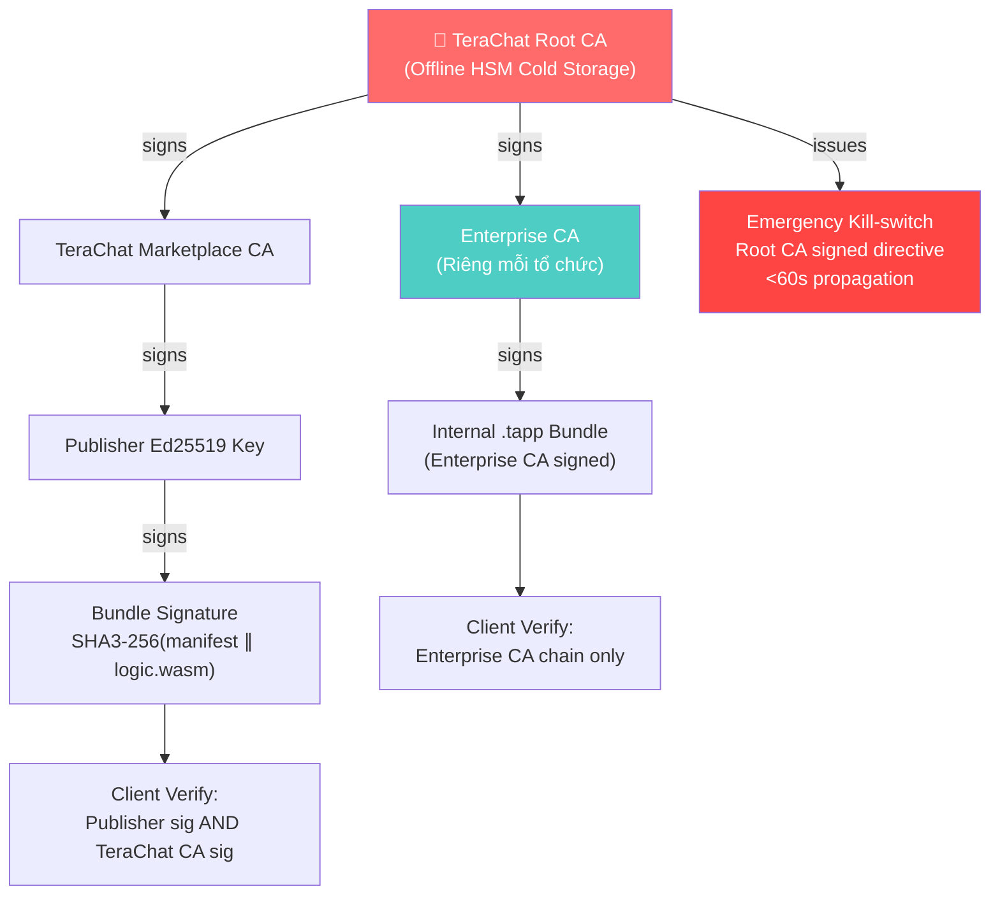

# TeraChat — WorkOS & Hệ sinh thái .tapp

> **Tài liệu tham chiếu duy nhất** cho kiến trúc WorkOS, .tapp Runtime, kênh phân phối, DataGrant Framework, Enterprise Governance, Data Export, và Migration pipeline. Tổng hợp từ TERA-RUNTIME, TERA-ECO, TERA-GOV, và các ADR liên quan.

---

## 1. Tầm nhìn WorkOS

TeraChat **là Enterprise Work OS**, không phải ứng dụng nhắn tin. Nhân viên chạy nghiệp vụ trực tiếp bên trong ứng dụng thông qua các mini-app `.tapp` — từ phê duyệt chi phí, ký tài liệu, quản lý task, đến tự động hóa bằng AI cục bộ.

```
┌───────────────────────────────────────────────────────┐
│                   TERACHAT WORK OS                     │
│                                                       │
│  ┌─────────┐ ┌──────────┐ ┌────────┐ ┌────────────┐  │
│  │ Finance │ │    HR    │ │ Project│ │ Supply Chain│  │
│  │ .tapp   │ │  .tapp   │ │ .tapp  │ │   .tapp    │  │
│  └─────────┘ └──────────┘ └────────┘ └────────────┘  │
│                                                       │
│  Deployment: By Region · By Department · By Role      │
└───────────────────────────────────────────────────────┘
```

### 1.1 Hierarchical Authority Messaging

Luồng giao tiếp tuân theo **cấp bậc tổ chức**, không phải mạng xã hội mở:

```
                    ┌──────────────────┐
                    │   HEADQUARTERS    │
                    │  (Root Authority) │
                    └──────┬───────────┘
                           │
           ┌───────────────┼───────────────┐
           │               │               │
    ┌──────▼──────┐ ┌──────▼──────┐ ┌──────▼──────┐
    │  BRANCH A   │ │  BRANCH B   │ │  BRANCH C   │
    │ (Region 1)  │ │ (Region 2)  │ │ (Region 3)  │
    └──────┬──────┘ └─────────────┘ └─────────────┘
           │
    ┌──────▼──────┐
    │ DEPARTMENT  │
    │  Finance    │
    └─────────────┘
```

| Hướng giao tiếp | Hỗ trợ | Phạm vi |
|---|---|---|
| Dọc (trên → dưới, dưới → trên) | ✅ | Department authority chain |
| Ngang (cùng cấp, cùng department) | ✅ | Department workspace |
| Liên phòng ban (cùng chi nhánh) | ✅ | Branch workspace + authorization |
| Liên chi nhánh (Branch A ↔ Branch B) | ✅ | **Qua HQ-authorized channel** — không bypass |
| Chi nhánh → Headquarters | ✅ | Root authority channel |
| Employee → Customer | **❌** | Ngoài phạm vi |
| External / Public / Anonymous | **❌** | Không hỗ trợ |

> **Nguyên tắc bất biến:** Mỗi workspace có **authority ceiling bất biến** — phạm vi quyền KHÔNG thể mở rộng sau khi tạo. Department head tạo workspace → scope = department. HQ tạo → scope có thể span nhiều branch.

### 1.2 Tại sao không có customer-facing messaging?

TeraChat không giải quyết bài toán network coordination bắt buộc khách hàng ngoài chuyển platform. Email, điện thoại, support desk đã phục vụ mục đích này. TeraChat tập trung vào **internal coordination** — nơi enterprise kiểm soát cả hai đầu.

---

## 2. Kiến trúc .tapp Runtime

### 2.1 WASM Sandbox

.tapp chạy trong WASM Sandbox **hoàn toàn cách ly**:

- **Không có network access trực tiếp:** `wasi-sockets` bị strip. Mọi I/O đi qua Host ABI → Rust Core OPA policy check
- **Crypto delegation:** WASM code không tự thực hiện crypto — phải gọi Host ABI (hardware-backed keys)
- **Manifest-declared permissions:** Mọi capability khai báo tại install time, không xin runtime — không có permission escalation
- **Region/department sandbox:** .tapp không truy cập data ngoài scope triển khai

```
┌─────────────────────────────────────────────────────────────┐
│                    .tapp WASM SANDBOX                        │
│                                                              │
│  ┌─────────────┐  ┌─────────────┐  ┌──────────────────────┐│
│  │ UI Schema   │  │ Business    │  │ SQLite Virtual       ││
│  │ (JSON/DSL)  │  │ Logic       │  │ Tables (Encrypted)   ││
│  └──────┬──────┘  └──────┬──────┘  └──────────────────────┘│
│         └──────┬──────────┘                                  │
│                │ Host ABI calls only                         │
│                ▼                                             │
│  ┌─────────────────────────────────────────────────────────┐│
│  │              RUST CORE HOST ABI                         ││
│  │  crypto / storage / network / event bus / AI            ││
│  └──────────────────────┬──────────────────────────────────┘│
│          ┌──────────────┴─────────────────┐                 │
│          ▼                                ▼                  │
│  [Encrypted App Data]           [Egress_Outbox]              │
│  cold_state.db                  (write-only, 2MB limit)      │
└─────────────────────────────────────────────────────────────┘
                                   │
                         OPA DLP Check + BLAKE3 verify
                                   ▼
                           [Internet / Partner API]
```

### 2.2 Dual-Engine Strategy (ADR-004)

iOS enforce W^X (write-xor-execute) — memory pages không thể đồng thời writable và executable → block mọi JIT compiler.

| Platform | Engine | JIT | Performance | Ghi chú |
|---|---|---|---|---|
| 📱 iOS | `wasm3` (pure interpreter) | ❌ (W^X) | 10–100x slower, +15–20ms/call | Không có cách khác trên iOS |
| 📱 Android | `wasmtime` (Cranelift JIT) | ✅ | Near-native speed | — |
| 📱 HarmonyOS | `wasmtime` JIT | ✅ | Near-native | `.waot` AOT bundle cho AppGallery |
| 💻 Desktop/Server | `wasmtime` (Cranelift JIT) | ✅ | Baseline | macOS: XPC process isolation |

**WasmParity CI Gate:** Mọi `.tapp` **PHẢI** pass cả 2 engine trước khi publish:

- Cùng test vector → cùng output trên `wasm3` và `wasmtime`
- Latency delta ≤ 20ms, memory ≤ 5MB tolerance
- **Float Detection Gate (HIGH-3):** LLVM IR analysis scan và **block merge** nếu `f32`/`f64` xuất hiện trong `.tapp` có `arithmetic_mode: fixed_point` — không phải soft warning
- **Fuel Limit Gate (TD-003):** Simulate worst-case execution path, verify fuel không exhaust trước khi hoàn thành core logic

### 2.3 Resource Limits

| Resource | 📱 Mobile (Active) | 💻 Desktop (Active) | Background |
|---|---|---|---|
| RAM | 50MB hard kill | 128MB | 10MB (OS suspend budget) |
| Execution | Fuel metering (instruction_fuel) | Fuel metering | 30s max + fuel |
| Egress | 2MB hard limit | 2MB hard limit | Không có network I/O |
| Storage quota | app_local_storage_mb (manifest) | app_local_storage_mb | — |
| SIMD | ❌ disabled | ❌ disabled | — |

### 2.4 Gas/Fuel Metering (thay vì time-based timeout)

Timeout theo giây **thiên vị hardware mạnh** — `.tapp` chạy ổn trên Desktop có thể vượt 30s timeout trên iOS. Fuel metering giải quyết triệt để:

```yaml
# .tapp Manifest
computation:
  instruction_fuel: 50_000_000       # Deterministic bất kể engine/hardware
  fuel_per_background_tick: 5_000_000
```

```
wasmtime: set_fuel(10_000_000) → 10M instructions, nhanh
wasm3:    set_fuel(10_000_000) → 10M instructions, chậm hơn nhưng cùng budget
```

Khi hết fuel → `.tapp` bị buộc dừng — **deterministic tuyệt đối** trên mọi platform.

### 2.5 Fixed-point Arithmetic cho .tapp tài chính

`f32`/`f64` bị **block** cho `.tapp` khai báo `arithmetic_mode: fixed_point`. Financial math bắt buộc dùng `i64` (up to 4 decimal places). Floating-point chỉ được phép cho non-critical logic (probability scoring). Enforcement qua LLVM IR CI gate — không phải advisory.

---

## 3. Host ABI

Host ABI là tập hợp functions mà Rust Core expose cho `.tapp` WASM modules. Mọi input/output serialize bằng **MessagePack** với schema version field (Rule 1: Typed Contract, Not a Pipe).

| Function | Mục đích | Giai đoạn |
|---|---|---|
| `host_blake3_hash` | Hashing (BLAKE3) | Phase 1 |
| `host_ed25519_sign` | Digital signing (Ed25519, hardware-backed) | Phase 1 |
| `host_aes256gcm_encrypt` | Symmetric encryption (AES-256-GCM) | Phase 1 |
| `host_db_query` | Database query — **Cursor Protocol**, PAGE_SIZE=500 | Phase 1 |
| `host_db_cursor_next` | Fetch next page từ cursor | Phase 1 |
| `host_db_cursor_close` | Đóng cursor, giải phóng resource | Phase 1 |
| `host_app_state_write` | Ghi data (quota enforce synchronous, trả `-5` nếu vượt) | Phase 1 |
| `host_storage_get` / `set` | Key-value storage (scoped per .tapp namespace) | Phase 1 |
| `host_event_publish` | Publish event lên Local Event Bus | Phase 1 |
| `host_event_subscribe` | Subscribe event type | Phase 1 |
| `host_egress_write` | Ghi vào Egress Outbox (write-only, DLP hash chain) | Phase 1 |
| `host_ai_invoke` | AI inference (model_id, prompt, max_tokens) | Phase 2D |
| `host_ai_status` | Kiểm tra trạng thái AI model | Phase 2D |
| `host_ai_register` | Đăng ký custom model (ONNX/CoreML) | Phase 2D |

### 3.1 Cursor Protocol (giải quyết OOM)

WASM heap có ceiling `<64MB`. Không thể materialized toàn bộ result set vào memory:

```rust
extern "C" {
    // Trả về cursor_id (u64) hoặc 0 nếu lỗi
    fn host_db_query(
        tapp_did_ptr: *const u8, did_len: usize,
        sql_ptr: *const u8, sql_len: usize,
        params_msgpack: *const u8, params_len: usize,
    ) -> u64;

    // Returns bytes_written, 0 = exhausted, -1 = error
    fn host_db_cursor_next(
        cursor_id: u64,
        out_row_msgpack: *mut u8,
        out_max: usize,
    ) -> i32;

    fn host_db_cursor_close(cursor_id: u64) -> i32;
}
```

### 3.2 Egress Outbox

Data diode architecture — `.tapp` chỉ có thể **write** vào Egress_Outbox, không có callback ngược:

| Property | Value |
|---|---|
| Type | Write-only queue (từ .tapp), Read-only (từ Egress Daemon) |
| Size limit | **2MB cứng** — vượt = sealed + terminate .tapp |
| Security | BLAKE3 DLP Hash Chain (Rust Core ký trước push) |
| Return codes | 0=OK, 1=QuotaExceeded, 2=SchemaViolation, 3=OPADeny, 4=MeshRestricted |

### 3.3 Tapp Ownership Invariant (Rule 2)

> **"App Suite Tapps Own Their Data, Nobody Else Does"**

- DataGrant là **READ-ONLY**
- `.tapp` A **KHÔNG BAO GIỜ** ghi đè trực tiếp vào namespace của `.tapp` B
- Nếu cần cập nhật dữ liệu cross-tapp → phải qua `host_event_publish` trên Local Event Bus
- Total isolation and accountability

---

## 4. Kênh Phân phối .tapp

TeraChat có **HAI kênh phân phối riêng biệt** — Marketplace cộng đồng và Enterprise Private Distribution. Hai kênh này hoạt động **hoàn toàn độc lập**.

### 4.1 Marketplace Cộng đồng (terachat.io)

```
Developer viết .tapp
    → Submit lên TeraChat Registry
    → Automated Static Analysis (WASM bytecode, manifest, LLVM IR, WasmParity)
    → Any critical finding → Manual Security Review Queue
    → All clear → TeraChat Marketplace CA sign bundle
    → Publish lên Registry (TransparencyLogEntry appended)
    → User browse trên web (terachat.io)
    → Purchase trên website (payment CHỈ trên web, KHÔNG trong app)
    → Download .tapp bundle (BLAKE3 + Ed25519 verify)
    → IT Admin approve cho workspace
    → OPA policy push → devices deploy .tapp
```

#### Publisher Trust Tiers

| Tier | Yêu cầu | Quyền Egress | Badge |
|---|---|---|---|
| **Unverified** | Ed25519 key đã đăng ký | HTTP GET only, < 1KB payload | 🔵 Community |
| **Verified** | KYC + Key + Security Review | File < 10MB, standard consent | ✅ Verified |
| **Enterprise** | SOC2/ISO27001 cert | Full file egress, custom consent | 🏢 Enterprise |
| **TeraChat Native** | First-party .tapp | Unrestricted (subject to OPA) | ⭐ Native |

#### Security Review Pipeline

1. **WASM Bytecode Analysis:** Abstract Interpretation — buffer overflow, forbidden syscall, data accumulation pattern
2. **Manifest Validation:** Egress domain check, schema completeness, capability declaration audit
3. **LLVM IR Analysis:** Obfuscated string detection, unusual CFG, float detection cho financial .tapp
4. **Dependency Audit:** Third-party WASM imports phải nằm trong allowlist
5. **WasmParity Gate:** Run test vectors trên cả `wasm3` + `wasmtime`
6. **Revenue:** 30% platform fee — mọi revenue collection và publisher payouts xử lý trên terachat.io

### 4.2 Enterprise Private Distribution (IT Nội bộ)

> **IT Admin tự code, tự ký, tự duyệt, tự phân phối — KHÔNG cần qua TeraChat marketplace.**

```
Internal dev builds .tapp (manifest: "private_distribution": true)
    → Ký bằng Enterprise CA Key (KHÔNG cần TeraChat public CA)
    → Upload lên MDM/EMM server (Jamf Pro / Microsoft Intune / Kandji)
    → MDM policy push .tapp bundle đến enrolled device group
    → Rust Core: verify Enterprise CA chain → load allowed
    → KHÔNG xuất hiện trên TeraChat public Registry
    → IT Admin controls deployment (Region/Department/Branch/Role)
```

| Đặc điểm | Marketplace | Enterprise Private |
|---|---|---|
| Ai review? | TeraChat Security Team | IT Admin tự duyệt |
| Ai ký? | TeraChat Marketplace CA | Enterprise CA (riêng) |
| Phân phối qua? | TeraChat Registry | MDM/EMM (Jamf, Intune, Kandji) |
| Cần TeraChat CA? | ✅ Bắt buộc | ❌ Không cần |
| Revenue share? | 30% | 0% (internal) |
| Visibility? | Public registry listing | Hoàn toàn private |

#### Deployment Scoping (cả hai kênh)

| Scope | Ví dụ | Control |
|---|---|---|
| By Region | "Inventory .tapp chỉ cho APAC branches" | Region-level Admin toggle |
| By Department | "Expense .tapp chỉ cho Finance" | Department-level role gate |
| By Branch | "Compliance .tapp cho Branch B only" | Branch-level deployment |
| By Role | "Approval .tapp chỉ cho Managers+" | Role-based access (OPA policy) |

---

## 5. App Signing Trust Hierarchy



### 5.1 Verification Rules

- **Marketplace .tapp:** Phải có CẢ Publisher sig VÀ TeraChat CA sig → không có = Core từ chối load
- **Enterprise Private .tapp:** Enterprise CA tự ký → KHÔNG cần Root CA chain
- **Content-addressed:** CAS_UUID = BLAKE3(bundle_bytes) — same hash = same bytes

### 5.2 Emergency Kill-switch

```
TeraChat Security Team detects compromise
    → Issues KILL_DIRECTIVE:
      {tapp_id, reason, evidence_hash, ed25519_sig (Root CA)}
    → Push via OPA update channel
    → Devices receive trong <60s (online)
    → Rust Core:
        ├── Terminate running instance
        ├── Purge transient state (sled KV)
        ├── Revoke mọi DelegationTokens của .tapp
        └── Append Audit_Log_Entry (PLUGIN_KILLED)
    → IT Admin nhận notification + technical report
```

Không cần app update hay store review. Kill directive cached — enforce on reconnect cho offline devices.

---

## 6. DataGrant Framework

> **DataGrant là cryptographic, scoped, short-lived access token — KHÔNG PHẢI static API key.**

DataGrant là cơ chế TeraChat cấp quyền truy cập data cho `.tapp`:

| Property | Giá trị |
|---|---|
| Bản chất | Cryptographic capability token |
| Scope | Bound to: **user + thread + time window** |
| Lifetime | Short-lived (TTL configurable, Gov: 0s offline serve) |
| So với API key? | API key = static, long-lived, global. DataGrant = dynamic, scoped, ephemeral |

### 6.1 Generation Counter Semantics

| Generation | Ý nghĩa |
|---|---|
| 0 | Grant chưa bao giờ được tạo |
| N (odd) | Grant **active** (version N) |
| N (even) | Grant **revoked** (version N) |

### 6.2 Quorum Protocol (ADR-005)

Giải quyết 3 threat vectors: rogue admin, offline grant injection, split-brain activation.

```
1. Admin khởi tạo DataGrant request
2. Request broadcast đến mọi node có election_weight > 0
3. Mỗi node validate:
   - License JWT valid
   - OPA policy allows the grant
   - Grant generation > local known generation
4. Node ký vote bằng Ed25519 device key
5. Quorum collector chờ majority (⌈N/2⌉ + 1) votes
6. Đủ quorum → DataGrant status = ACTIVE
7. Không đủ → status = PENDING_QUORUM (data KHÔNG được serve)
```

| Tier | Quorum yêu cầu |
|---|---|
| **Standard Enterprise** | Simple majority (3/5 nodes) — quorum không bắt buộc, single-node activation OK |
| **Gov/Military** | Supermajority (3/5 + ít nhất 2 node từ physical locations khác nhau) |
| **Unconfirmed grants** | Return `PENDING_QUORUM` — **KHÔNG BAO GIỜ** serve data mà chưa đủ quorum |

```rust
pub struct DataGrant {
    id: DataGrantId,
    generation: u64,                    // odd=active, even=revoked
    activation_quorum: ActivationPolicy, // None | Majority | SuperMajority
    hash_frontier: HashFrontier,         // Compact Bloom/Hash summary for gossip
}
```

### 6.3 Cache with Active Revocation

DataGrant Revocation là **SECURITY SIGNAL PUSH**, không phải passive TTL check:

1. OPA Policy push lệnh revoke
2. Rust Core `host_db_cursor_close` mọi connection đang chạy
3. `CoreSignal::DataGrantRevoked` bắn **đồng bộ** qua Secure Channel (không queue)
4. Quét Prefix Sled Cache (`dg:{grant_id}:*`) → xóa ngay lập tức
5. Abort in-progress fetches nếu có (Drop connection, KHÔNG commit partial data)

**Mesh Mode Offline Guard:**

| Tier | `max_offline_serve_duration` | Behavior |
|---|---|---|
| Enterprise | 3600s (1h) | Serve cached data, hiển thị "Unavailable" khi quá TTL |
| Gov/Military | 0s | Policy "require-quorum-confirmation" — lock data đến khi quorum restored |

### 6.4 Mesh Revocation Gossip (CRIT-03)

Khi admin revoke DataGrant trong lúc field agents đang Mesh-only, OPA push channel không đủ:

- Revocation signal broadcast như signed `Event` vào `event_log.db`
- `content_type: "governance/data_grant_revoked@v1"`
- Mọi node serve DataGrant phải check local DAG: `SELECT 1 FROM crdt_events WHERE content_type = 'governance/data_grant_revoked@v1' AND payload->>'grant_id' = ? AND hlc > grant_issued_at`
- Cost: một SQLite query per DataGrant access — negligible

### 6.5 Row Filter Expression Language

Row-level DataGrant filter sử dụng **Predicate DSL** (không phải full OPA Rego — tránh execution overhead):

```json
{"field": "department", "op": "eq", "value": "HR"}
```

- Operators: `eq`, `neq`, `in`, `gte`, `lte`
- Nesting: `and/or` depth ≤ 3
- Evaluation: Rust Core đánh giá predicate tại `cold_state.db` **TRƯỚC** khi data vào WASM boundary

---

## 7. Enterprise Governance (Identity & Compliance)

### 7.1 Identity Federation

```
[Enterprise IdP: Azure AD / Okta / Google Workspace]
          │ SAML Assertion / OIDC ID Token
          ▼
[Identity Broker: Keycloak/Dex]
          │ Map → TeraChat Role + Ed25519 Capability Token
          ▼
[TeraChat API Gateway]
          │ Verify Capability Token
          ▼
[Rust Core: enforce role-based IPC permissions]
          │
[SCIM 2.0 Listener: sync user provisioning/deprovisioning]
```

### 7.2 OPA ABAC Policy Enforcement

- Policies viết bằng **Rego** (OPA format)
- Enforce tại **2 điểm**: API Gateway + Client Device Rust Core (Zero-Trust: device enforce ngay cả khi relay bị compromise)
- **Z3 Formal Verification** bắt buộc trước deploy — chứng minh policy set consistent, không có logical contradictions
- Deploy requires: `policy_bundle.ed25519_sig valid` AND `Z3 verification passed`

```rego
package terachat.api
default allow = false

allow {
    input.method == "POST"
    input.path == "/api/v1/messages"
    has_valid_token(input.token)
    not is_rate_limited(input.client_id)
    geo_policy_allows(input.geo_hash, data.org_policy.allowed_geos)
}
```

### 7.3 RBAC với Cryptographic Enforcement

| Thành phần | Chi tiết |
|---|---|
| Roles | Organization Admin, IT Admin, Member, Guest |
| Role mapping | Mỗi role map đến cryptographic capabilities (DataGrants) |
| Approval actions | Ed25519 signatures bắt buộc — **non-repudiation** (không phải DB flag) |
| Hardware binding | `DeviceIdentityKey` bound vào hardware — không thể forge hoặc deny |

### 7.4 SCIM 2.0 Offboarding (< 30s)

```
HR fires SCIM PATCH: user status = inactive
    → SCIM Listener receives event
    → Rust Core actions (< 30s total):
        ├── Mark user_id revoked trong OPA policy cache
        ├── Trigger MLS Epoch Rotation cho mọi affected groups
        ├── Revoke DelegationTokens với source_id = user_id
        ├── Push Shun_Record signed by Enterprise CA đến mesh
        └── Append Audit_Log_Entry (action: "user_revoked")
```

### 7.5 Immutable Audit Trail

| Property | Value |
|---|---|
| Format | Ed25519 signed, append-only CRDT chain |
| Immutability | Không thể delete hoặc modify — kể cả TeraChat Inc. |
| Legal Hold | `LegalHoldFlag` blocks tombstone vacuum at storage level |
| Structure | `{device_id, timestamp, action, payload_hash, ed25519_sig}` |
| Replay | 100% replayable — không gaps trong append-only chain |

### 7.6 .tapp Capability Model

Mọi capability khai báo trong manifest — **KHÔNG có runtime permission requests**:

```yaml
capabilities:
  read_message_context: false       # Không read chat history
  write_egress_outbox: true         # Có thể gửi data ra (OPA DLP filtered)
  app_local_storage_mb: 50          # SQLite Virtual Tables quota
  event_bus_publish: ["approval.submitted"]
  event_bus_subscribe: ["user.role_changed"]
  background_tick_interval_s: 300   # 5min background wakeup
  request_ai_inference: true        # AI inference
arithmetic_mode: "fixed_point"      # Blocks f32/f64
```

---

## 8. Data Export & Sovereignty

TeraChat guarantee: tổ chức sở hữu data và có thể rời bất cứ lúc nào với export hoàn chỉnh, verifiable — no vendor lock-in.

### 8.1 Thách thức

- Mọi data là E2EE + stored dưới dạng CRDT DAGs
- Server **không thể** produce export (chỉ hold ciphertext)
- Direct DB dump = unreadable blobs
- Phải decrypt và transform **client-side** mà vẫn giữ hierarchy

### 8.2 Client-side Streaming Decryption Pipeline

```
Export Request + DID Signature
         ↓
OPA Policy Check (user có quyền export scope này không?)
         ↓
Key Retrieval (symmetric Message Keys từ Secure Hardware)
         ↓
Cursor-based Event Log Traversal (event_log.db, chunks)
         ↓
Streaming Decryption (CRDT ops → plaintext → squash final state)
         ↓
Sovereign Portability Format (SPF) Packaging
  • JSON (messages, threads)
  • CSV (structured data)
  • HTML (human-readable archive)
  • manifest.sig (Ed25519 cryptographic proof of integrity)
         ↓
ZIP Archive → delivered to user
```

### 8.3 SPF (Sovereign Portability Format)

| Component | Mục đích |
|---|---|
| JSON files | Messages, threads — machine-readable |
| CSV files | Structured data — import vào spreadsheet/BI |
| HTML files | Human-readable archive — browse offline |
| `manifest.sig` | Ed25519 signature trên SHA-256 hash of archive — non-repudiation |

### 8.4 "Encryption as Authorization"

- User chỉ export data mà **DID key của họ có thể decrypt**
- Bị remove khỏi channel trước khi export → không export được channel đó
- OPA policy enforcement trên export scope
- Streaming pipeline: 10GB+ data mà không vượt 512MB RAM overhead

---

## 9. Migration từ Slack/Teams/Google Chat

### 9.1 One-way Migration

Migration là **one-way** — không có bi-directional sync. Đây là thiết kế có chủ đích để enforce data sovereignty.

### 9.2 Migration Pipeline

```
Authorized Migration .tapp (chạy trong WASM Sandbox)
    → OAuth 2.0 / Admin API keys → fetch legacy data
       (hoặc parse raw ZIP archive export)
    → Transform:
        ├── Workspace/Teams → TeraChat Mesh Network / Organization ID
        ├── Channels → CRDT Topic/Room (symmetric key per channel)
        ├── Threads → DAG Sub-branch (parent_hash reference)
        └── Roles → DID profiles + OPA Policies
    → Re-encrypt mọi messages client-side (AES-256-GCM)
    → Inject vào local event_log.db (Event Log operations)
    → Sync encrypted blobs đến TeraChat network
    → Drop all memory buffers (ZeroizeOnDrop)
```

### 9.3 Shadow DID Mapping

| Bước | Chi tiết |
|---|---|
| 1. Generate | Placeholder "Shadow DIDs" cho mọi imported users |
| 2. Claim | User đăng nhập lần đầu qua Enterprise SSO/SAML → claim Shadow DID |
| 3. Key generation | Device tạo Kyber768/Ed25519 keypair |
| 4. Access | User seamlessly access historical encrypted data |

### 9.4 Role → OPA Policy Conversion

| Legacy Role | TeraChat Mapping |
|---|---|
| Workspace Admin | `Organization Admin` (Global OPA Policy) |
| Private Channel Member | Encrypted channel keys wrapped cho specific DID |
| Guest / External | Scoped DataGrant — restrict access đến specific CRDT branches |

### 9.5 Edge Cases

| Case | Xử lý |
|---|---|
| **Unmapped users** | Shadow DID placeholder — claimed on first SSO login |
| **Orphaned threads** | Threads có parent message bị xóa → preserve as root-level orphan nodes |
| **Circular permissions** | Slack private channels shared externally → flatten thành linear OPA rules |
| **Data volume** | Millions of messages → streaming, không lock main execution thread |

### 9.6 Zero-Knowledge Maintenance

Migration .tapp chạy trong WASM Sandbox → infrastructure servers chỉ thấy encrypted DAG nodes. Mọi plaintext processing xảy ra client-side hoặc trong Secure Enclave, với `ZeroizeOnDrop` cho mọi memory buffer.

---

## 10. Liên kết Wiki

| Trang | Mô tả |
|---|---|
| [[00_Architecture_Overview]] | Kiến trúc tổng quan TeraChat |
| [[01_Mesh_and_Crypto]] | Mật mã, MLS, Mesh networking |
| [[03_Local_AI_Integration]] | AI cục bộ, Qwen2.5, Open AI Framework |
| [[Invariants]] | Quy tắc bất biến hệ thống |
| [[WASM Tapp Runtime]] | Chi tiết runtime specification |
| [[Tapp community framework]] | SDK, Tapp trait, contribution flow |
| [[ADR-004 WASM dual engine]] | Quyết định kiến trúc dual-engine |
| [[ADR-005 DataGrant quorum protocol]] | Quyết định quorum protocol |
| [[Enterprise identity governance]] | DID, OPA, RBAC chi tiết |
| [[Data sovereignty export]] | Export pipeline chi tiết |
| [[Hierarchical authority messaging]] | Messaging model chi tiết |
| [[Open AI framework]] | Host ABI AI extension |
