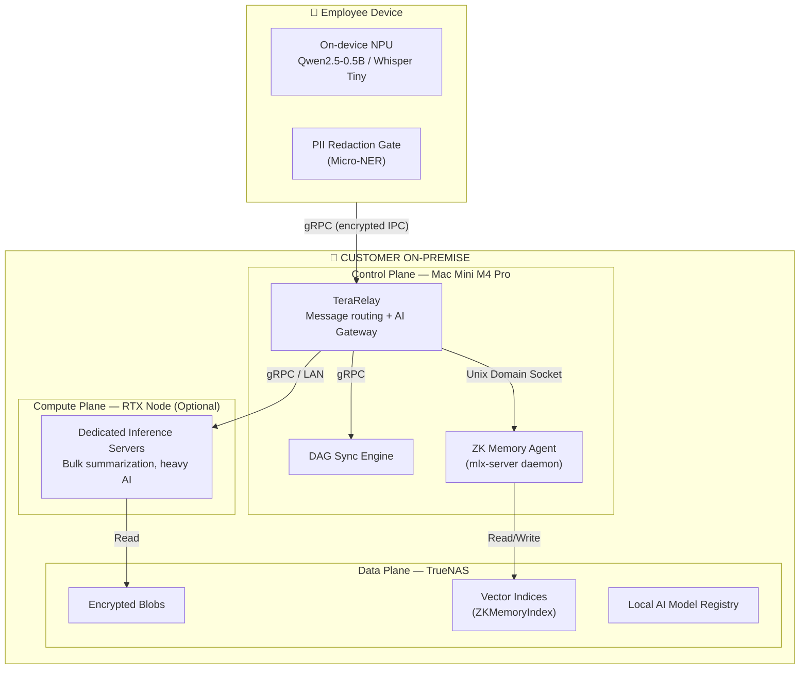
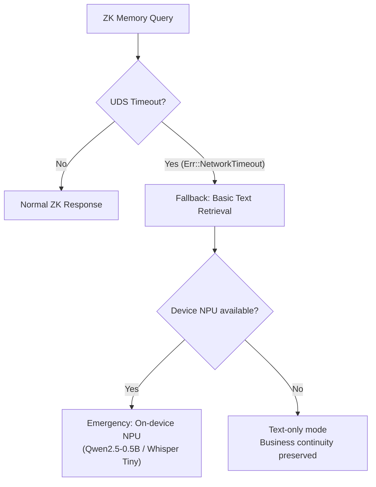
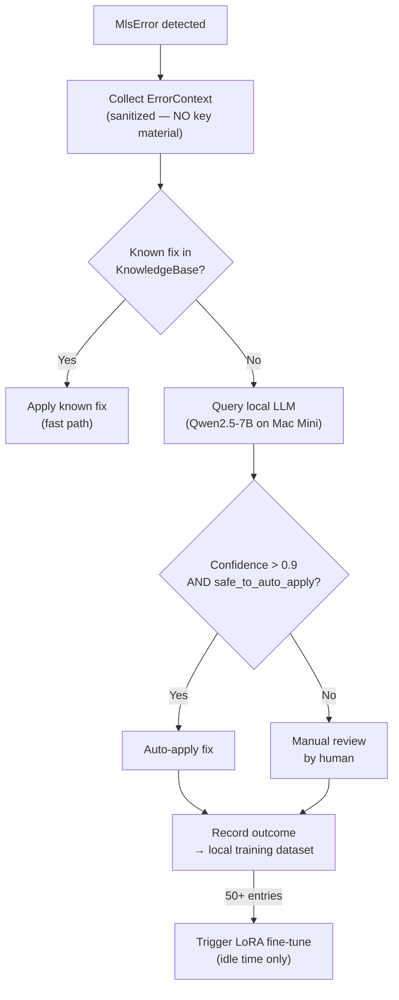
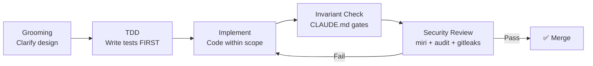

# TeraChat — Tích hợp AI Cục bộ

> Tài liệu gốc duy nhất (Single Source of Truth) cho mọi AI feature trong TeraChat. AI chạy hoàn toàn cục bộ, tách biệt khỏi messaging core, và **KHÔNG BAO GIỜ** gửi dữ liệu ra cloud.

---

## 1. Triết lý AI

### Nguyên tắc bất biến

| # | Nguyên tắc | Lý do |
|---|-----------|-------|
| 1 | AI chạy 100% cục bộ trên Mac Mini — **KHÔNG** gửi dữ liệu ra cloud | Zero-Knowledge: server-side AI sẽ nhìn thấy plaintext employee data |
| 2 | AI là **add-on**, không phải core — ship/fail/update **độc lập** với messaging | Messaging Phase 1 ship mà không cần AI sẵn sàng; AI fail → chat vẫn hoạt động |
| 3 | AI **KHÔNG BAO GIỜ** được truy cập `tc-crypto` | **P0 — CODEOWNERS lock.** LLMs cực kỳ kém trong việc thiết kế protocol mật mã chống Side-Channel Attack. Code pass `cargo check` ≠ an toàn toán học |
| 4 | Delivery timeline: **Phase 2D+** | AI workstream chạy sau messaging core ổn định |
| 5 | Cloudflare AI Gateway — **REJECTED vĩnh viễn** | Vi phạm 3 invariants: Zero-Knowledge, Offline-First, Air-gapped Gov tier |

### Decoupling Architecture

```
┌─────────────────────────────────────────-┐
│         MESSAGING CORE (Phase 1)         │
│                                          │
│  MLS E2EE · License · OIDC/SAML · Sync   │
│                                          │
│  ┌─────────────────────────────────────┐ │
│  │       AI HOST ABI (Interface)       │ │
│  │                                     │ │
│  │  host_ai_invoke(model, prompt)      │ │
│  │  host_ai_register(model_config)     │ │
│  │  host_ai_status() → ModelStatus     │ │
│  │                                     │ │
│  │  ─── RANH GIỚI. Dưới đây là AI.  ── │ │
│  └─────────────────────────────────────┘ │
└────────────────────┬────────────────────┘
                     │
┌────────────────────▼─────────────────────-─┐
│         AI WORKSTREAM (Phase 2D+)          │
│                                            │
│  ┌──────────┐ ┌──────────┐ ┌───────────┐   │
│  │ Qwen2.5  │ │  Claude  │ │ Enterprise│   │
│  │ (default)│ │ (API key)│ │  Custom   │   │
│  └────┬─────┘ └────┬─────┘ └─────┬─────┘   │
│       │            │             │         │
│  ┌────▼────────────▼─────────────▼─────┐   │
│  │      SANITIZATION PIPELINE          │   │
│  │  PII Redaction → Egress Guard       │   │
│  └─────────────────────────────────────┘   │
│                                            │
│  Có thể ship, fail, update ĐỘC LẬP         │
└────────────────────────────────────────────┘
```

### Lợi ích của decoupling

| Lợi ích | Giải thích |
|---------|-----------|
| Ship độc lập | Messaging core ship Phase 1 mà không cần AI sẵn sàng |
| Fail riêng | Model load fail → chat vẫn hoạt động bình thường |
| Update riêng | Cập nhật model (Qwen2.5-7B → 14B) không cần update cả app |
| Team riêng | ML engineer không cần hiểu MLS E2EE. Rust engineer không cần hiểu ONNX |
| Test riêng | AI quality (BLEU score, hallucination rate) test khác với messaging reliability |
| Pricing riêng | AI module bán như add-on — không bắt buộc trong base license |

Khi `ai_module: false` trong license → Host ABI vẫn có trong binary nhưng trả về `AiError::ModelNotLoaded` cho mọi request. Messaging core không bị ảnh hưởng.

---

## 2. Kiến trúc Local Appliance Model

TeraChat chuyển từ cloud-hosted AI sang **Local Appliance Model** — phần cứng on-premise của khách hàng **là** trust boundary.



### Thành phần chi tiết

| Plane       | Hardware                        | Chức năng                                       | Giao tiếp          |
| ----------- | ------------------------------- | ----------------------------------------------- | ------------------ |
| **Control** | Mac Mini > M2                   | TeraRelay routing, DAG sync, ZK Memory Agent    | gRPC, UDS          |
| **Compute** | RTX inference server (optional) | Heavy AI tasks, bulk summarization              | LAN-connected gRPC |
| **Data**    | TrueNAS (ECC RAM)               | Encrypted blobs, vector indices, model registry | NFS / iSCSI        |

### ZK Memory Agent Daemon

ZK Memory Agent chạy như **daemon riêng** (`mlx-server`) trên Mac Node, giao tiếp qua **Unix Domain Socket** (không qua TCP — loại bỏ LAN port-scan surface):

```
TeraRelay ──── UDS (/var/run/zk-memory.sock) ────► mlx-server daemon
```

### Batch Indexing Schedule

Duy trì ZK Memory Index (vector embeddings) là compute-intensive cho Apple Silicon. Continuous background vectorization gây thermal saturation.

| Trigger | Điều kiện | Lý do |
|---------|-----------|-------|
| **Scheduled** | 02:00 AM Local Time | Thermal decay time, hardware lifespan |
| **Threshold** | Queue > 80% NAS buffer capacity | Ngăn buffer overflow |
| **Manual** | Admin trigger qua Console | On-demand reindex |

---

## 3. Model AI Mặc định: Qwen2.5

### Model Matrix

| Model            | Size   | Use Case                             | Platform                | RAM Budget |
| ---------------- | ------ | ------------------------------------ | ----------------------- | ---------- |
| **Qwen2.5-1.5B** | ~1.8GB | Lightweight inference                | Mac Mini (minimal)      | 8GB+       |
| **Qwen2.5-7B**   | ~5GB   | Standard inference — **recommended** | Mac Mini M4 Pro         | 32GB+      |
| **Qwen2.5-14B**  | ~10GB  | Enhanced reasoning                   | Mac Mini M4 Pro cluster | 48GB+      |
| **Qwen2.5-32B**  | ~24GB  | Full capability                      | RTX Compute Node        | 64GB+      |


### Employee Task Automation

| Task                  | Model        | Data Source                 | Output               |
| --------------------- | ------------ | --------------------------- | -------------------- |
| Summarize long thread | Qwen2.5-7B   | Channel messages (last 200) | Bullet-point summary |
| Draft response        | Qwen2.5-7B   | Thread context + user style | Drafted message      |
| Extract action items  | Qwen2.5-7B   | Meeting notes / chat        | Task list            |
| Classify document     | Qwen2.5-7B   | File attachment             | Category + tags      |
| Translate message     | Qwen2.5-7B   | Foreign language text       | Translated text      |


---

## 4. PII Redaction Pipeline

> **[[Invariants|Invariant I-05]]:** PII redaction bat buoc TRUOC moi AI inference -- khong co ngoai le.

Thiet ke chi tiet cua Redaction Rules da duoc tach ra thanh tai lieu rieng: **[PII Redaction Rules](concepts/pii-redaction-rules.md)** — bao gom SanitizedPrompt newtype, pipeline flow, bang redaction rules, dac tinh va limitation.

---

## 5. ZK Memory Agent

> **TD-000 RESOLVED:** ZK Memory Agent **thay thế hoàn toàn** Blind RAG / `BlindVectorIndex`. Mọi reference đến "Blind RAG" trong codebase đã được cập nhật.

### Zero-Knowledge Guarantee

Dữ liệu **KHÔNG BAO GIỜ** rời device boundary:
- Vector embeddings sinh và lưu cục bộ trên Mac Mini / NAS
- Không embedding egress — không gửi vectors lên cloud
- Consolidation chạy hoàn toàn on-device

### IPC Contract — Unix Domain Socket

```rust
// Request Format: TeraRelay → ZK Memory Agent (qua UDS)
pub struct ZkMemoryQuery {
    pub session_id: SessionId,
    pub masked_context: Vec<u8>,  // ĐÃ QUA PII redaction
    pub query_type: ZkQueryType,  // Summary | Search | Suggest
    pub max_tokens: u32,
}

// Response Format: ZK Memory Agent → TeraRelay (qua UDS)
pub struct ZkMemoryResponse {
    pub session_id: SessionId,
    pub response_tokens: Vec<u8>,
    pub metadata: ResponseMetadata,
}

pub enum ZkQueryType { Summary, Search, Suggest }
```

### Search Strategy Integration

| Data Type | Engine | Scope | Notes |
|-----------|--------|-------|-------|
| Chat text (< 30 days) | SQLite FTS5 (local) | On-device only | Fast, private |
| Chat text (> 30 days) | ZK Memory Search | Mac Mini local cluster | Zero-Knowledge: data never leaves device |
| App/CRM fields | AES-SIV (SSE) | Server-side exact match | Server sees hash, not data |
| Documents/PDFs | ZK Memory Agent | Mac Mini / NAS Enclave | AI context built locally |

### Graceful Degradation

Khi `mlx-server` crash, overload, hoặc OOM:



TeraRelay bắt UDS timeout, **KHÔNG** crash 500 — emit analytic error và degrade gracefully.

---

## 6. AI Inference Offloading

Distributed inference với Rust thermal/RAM management. Tự động route AI requests đến endpoint tối ưu dựa trên device capability, thermal state, và network availability.

### ThermalMonitor

Background monitor polling OS thermal state. Consumer chỉ gọi `is_critical()` — interior complexity ẩn (Deep Module).

```rust
#[derive(Debug, Clone, Copy, PartialEq, Eq)]
pub enum ThermalState {
    Nominal,                         // All operations allowed
    Fair { throttle_factor: f32 },   // Reduce batch size
    Serious,                         // Only ≤ 256 tokens, suspend mesh sync
    Critical,                        // No inference, only E2EE messaging
}
```

Platform-specific polling: `ProcessInfo.thermalState` (iOS FFI) → IOKit sensors (macOS).

### InferenceScheduler Decision Tree

```rust
impl InferenceScheduler {
    pub fn decide(&self, req: &SanitizedRequest) -> Arc<dyn InferenceEndpoint> {
        match (self.thermal.state(), self.network.state(), req.estimated_tokens()) {
            // Critical: reject non-essential inference
            (ThermalState::Critical, _, _) => self.null_endpoint(),

            // Device NPU: small, fast, private — highest priority
            (_, _, t) if t <= 512 => self.device_npu_endpoint(),

            // Mac Mini local: medium complexity, on network
            (_, NetworkState::Connected, t) if t <= 4096 => self.mac_mini_endpoint(),

            // Cluster: complex requests, good network
            (_, NetworkState::Connected, t) if t <= 32768 => self.cluster_endpoint(),

            // Offline fallback: smallest model on device
            (_, NetworkState::Offline, _) => self.offline_fallback_endpoint(),

            // Too large: reject with clear message
            _ => self.rejection_endpoint(RejectionReason::TooLarge),
        }
    }
}
```

### Gas Metering by Thermal State

| Thermal State | Max Tokens | Allowed Operations | Action |
|---------------|------------|-------------------|--------|
| **Nominal** | 32768 | All inference, mesh sync | Full speed |
| **Fair** | 4096 | Reduced batch size | Throttle factor applied |
| **Serious** | 256 | Text-only, no mesh sync | Suspend non-essential |
| **Critical** | 0 | E2EE messaging only | **All AI inference stopped** |

### Invariant: PII Redaction LUÔN LUÔN trước inference

Bất kể routing decision (device NPU, Mac Mini, cluster, fallback) — `SanitizedPrompt` newtype guarantee rằng PII đã bị strip **TRƯỚC** khi request tới bất kỳ endpoint nào. Đây là compile-time guarantee, không phải runtime check.

---

## 7. BYOM (Bring-Your-Own-Model)

### Open AI Framework

TeraChat **không** lock enterprise vào single AI provider. Open AI Framework cho phép doanh nghiệp cắm model riêng.

```
┌──────────────────────────────────────────────┐
│           OPEN AI FRAMEWORK (Host ABI)        │
│                                               │
│  ┌──────────┐ ┌──────────┐ ┌──────────────┐  │
│  │ Qwen2.5  │ │  Claude  │ │  Enterprise  │  │
│  │ (default)│ │ (bring)  │ │  Custom ONNX │  │
│  └──────────┘ └──────────┘ └──────────────┘  │
│                      │                        │
│  ┌───────────────────▼────────────────────┐   │
│  │        SANITIZATION LAYER              │   │
│  │  PII Redaction → DomainPiiPolicy       │   │
│  │         → Egress Guard                 │   │
│  └────────────────────────────────────────┘   │
│                      │                        │
│  ┌───────────────────▼────────────────────┐   │
│  │        LOCAL EXECUTION                 │   │
│  │  ONNX Runtime · CoreML · MLX · GPU/NPU │   │
│  └────────────────────────────────────────┘   │
└───────────────────────────────────────────────┘
```

### Model Registration Flow

1. **Package model** — ONNX format (hoặc CoreML `.mlmodelc` cho Apple)
2. **Declare capabilities** — `manifest.json`: model name, version, RAM budget, supported tasks
3. **Sign with enterprise key** — Ed25519 signature từ enterprise CA
4. **Deploy via Admin Console** — Push to specific departments hoặc regions
5. **Integrity check** — BLAKE3 hash verified on every load

### Host ABI Extension

```rust
// Host ABI: AI Inference — exposed to .tapp WASM sandbox
fn host_ai_invoke(
    model_id: &str,           // "qwen2.5-7b", "claude-opus", "enterprise-custom"
    sanitized_prompt: &[u8],  // Already passed through PII redaction
    max_tokens: u32,
    temperature: f32,
) -> Result<AiResponse, AiError>;

fn host_ai_status(model_id: &str) -> ModelStatus;

fn host_ai_register(manifest: ModelConfig) -> Result<(), AiError>;
```

### Planned Providers

| Provider | Model | Deployment | Phase |
|----------|-------|------------|-------|
| **Alibaba** | Qwen2.5 (default, bundled) | MLX / ONNX local | Phase 2D |
| **Anthropic** | Claude (bring-your-own-key) | API with sanitized prompt proxy | Phase 2D |
| **Enterprise** | Custom fine-tuned model | ONNX via Admin push | Phase 2D |
| **Open Source** | Llama, Mistral, etc. | ONNX self-register | Phase 3 |
| **Marketplace** | terachat.io marketplace | Download + verify | Phase 3 (tương lai) |

### Data Sovereignty Guardrails

1. **SanitizedPrompt bắt buộc** — PII redaction TRƯỚC inference, bất kể model provider
2. **Local-first:** Qwen2.5 và ONNX models chạy hoàn toàn on-device
3. **API-based models (Claude, etc.):** Prompts sanitized → proxied qua enterprise relay → TeraChat Inc. **KHÔNG BAO GIỜ** nhìn thấy prompt
4. **Egress Guard:** Model output scanned cho PII leakage trước khi trả về user
5. **Audit log:** Mọi AI invocation được Ed25519 sign → immutable audit trail

---

## 8. OpenMLS Self-Healing với AI

> ⚠️ **Ambitious cho solo dev — likely Phase 3+.** MLS protocol errors phức tạp và cần deep crypto expertise.

### Problem

MLS protocol errors khó debug: group state inconsistency, epoch mismatch, pending proposal conflicts, openmls library bugs. Traditional debugging cần deep MLS expertise mà solo dev không có on-call.

### Solution: Local AI Debug Loop



### ErrorContext — KHÔNG BAO GIỜ chứa key material

```rust
pub struct MlsErrorContext {
    error_type: MlsErrorType,
    openmls_version: &'static str,
    group_state: GroupStateInfo,     // member_count, epoch, pending_proposals
    recent_ops: Vec<MlsOperationType>,  // Operation TYPES, no content
    stack_trace: SanitizedStackTrace,
    occurred_at: u64,               // Monotonic timestamp — no wall-clock correlation
}

impl MlsErrorContext {
    pub fn to_debug_prompt(&self) -> String {
        let json = serde_json::to_string_pretty(self).unwrap();
        // Sanity check: no long hex strings (potential keys)
        assert!(!json.contains_hex_sequence(32),
            "ErrorContext contains potential key material");
        // ... format prompt
    }
}
```

### Safety Guarantees

| # | Guarantee | Mechanism |
|---|-----------|-----------|
| 1 | ErrorContext never contains key material | Structural data only + hex sequence check |
| 2 | Diagnosis never leaves device | `Privacy::LocalOnly` enforced |
| 3 | **Human approval LUÔN BẮT BUỘC** | Shadow Branch proposal → user click Chấp nhận → Ed25519 sign → commit. Không có auto-apply exception. |
| 4 | Training data stays local | LoRA fine-tuning on-device via `mlx_lm.lora` |
| 5 | No wall-clock correlation | Monotonic timestamps only |

### Fine-Tuning

LoRA fine-tuning chạy trên Mac Mini **chỉ khi idle** (night, low thermal). Trigger sau khi collect 50+ training entries:

```bash
mlx_lm.lora --model qwen2.5-7b --train \
    --iters 100 \
    --adapter-path ./terachat-mls-debug-adapter
```

---

## 9. AI Gateway Architecture (ADR-006)

> **Status: ACCEPTED** — Hybrid H3 → H1 theo phase. Xem chi tiết tại [[ADR-006 AI gateway architecture]].

### Phase 1 MVP: TeraRelay Extension

Mở rộng `TeraRelay` binary — thêm `/ai/v1/` route tích hợp vào existing auth/relay infrastructure:

```
Client App (Flutter/Tauri)
    │
    ▼ gRPC (existing encrypted IPC channel)
TeraRelay (single binary)
    ├── [existing] Message routing
    ├── [existing] License JWT validation
    └── [NEW] AI Gateway (/ai/v1/)
            ├── Auth: License JWT → per-tenant config
            ├── Rate limit: per seat
            ├── PII Redaction: ONNX Micro-NER (MANDATORY)
            └── ──TLS 1.3──► BYOM Endpoint (configurable)
```

**Rationale:** Giữ "1 binary, 1 command" deployment → IT Admin ≤ 30 phút. Reuse auth stack: License JWT validation đã có sẵn.

### Phase 2D: Native Rust SDK

Migrate sang `tc-enclave` native SDK — direct TLS 1.3, no intermediate hop:

```rust
pub struct AiGateway {
    pii_gate: OnnxPiiRedactor,   // MANDATORY — PII stripped trước request
    endpoint: Url,               // configurable: Ollama / vLLM / internal
    client: reqwest::Client,     // TLS 1.3, no proxy
    audit: AuditTrailSigner,     // Ed25519 sign mọi AI request
}
```

### Rejected Approaches

| Approach | Verdict | Lý do |
|----------|---------|-------|
| H4: Cloudflare AI Gateway | ❌ REJECTED vĩnh viễn | Plaintext metadata rời org boundary, không offline, không air-gapped |
| Local HTTP Proxy (127.0.0.1) | ❌ REJECTED trong production | Bất kỳ process nào cùng máy intercept được. Dev-only với explicit env var |


---

## 10. Multi-Agent Development Harness

> *"You are the strategic architect. AI is the tactical programmer."* — Matt Pocock

### Vai trò

| Layer | Responsibility | Owner |
|-------|---------------|-------|
| **Strategic** | Architecture, security review, customer dev | Human |
| **Tactical** | Code generation, testing, documentation | AI Agents |

### Agent Types

| Agent | Scope | Tools | Constraint |
|-------|-------|-------|------------|
| **Rust Agent** | `source/core/tc-*/**` | cargo, clippy | Cannot cross crate boundaries without review |
| **Test Agent** | `tests/`, `*_test.rs` | cargo nextest, proptest | Must follow TDD contract |
| **Security Agent** | All code | cargo miri, audit, gitleaks | **Veto power** on invariant violations |
| **Doc Agent** | `docs/wiki/` | Obsidian CLI | Append-only on log.md |
| **Proto Agent** | `source/core/proto/**` | buf | Must pass buf breaking |
| **Review Agent** | All PRs | Git diff | Checks CLAUDE.md compliance |

### ⚠️ Critical Boundary

```
┌────────────────────────────────────────────┐
│  ⛔ source/core/tc-crypto/                 │
│                                            │
│  AI KHÔNG ĐƯỢC SỬA CODE TRONG THƯ MỤC NÀY │
│                                            │
│  .github/CODEOWNERS lock — chỉ human       │
│  architect có quyền merge vào tc-crypto    │
└────────────────────────────────────────────┘
```

**Lý do:** LLMs (Claude, GPT-4, Qwen) cực kỳ kém trong việc thiết kế protocol mật mã chống Side-Channel Attack hoặc quản lý Domain Separation String trong KDF. Code pass `cargo check` hoặc `clippy` **không đại diện** cho tính an toàn toán học. Đây là **P0** từ expert audit panel.

### TDD Workflow



---

## 11. Liên kết Wiki

### Master Documents

| Document | Liên quan đến AI |
|----------|-----------------|
| [[00_Architecture_Overview]] | Kiến trúc tổng quan — Local Appliance Model |
| [[01_Mesh_and_Crypto]] | Mật mã — **AI bị cấm truy cập `tc-crypto`** |
| [[02_WorkOS_and_Tapp_Ecosystem]] | `.tapp` Host ABI cho AI (`host_ai_invoke`) |

### Concept Pages

| Page | Nội dung |
|------|---------|
| [[ADR-006 AI gateway architecture]] | Quyết định kiến trúc AI Gateway — Loại bỏ local proxy |
| [[AI inference offloading]] | Distributed inference, ThermalMonitor, InferenceScheduler |
| [[Secure enclave and AI security]] | PII redaction spec, Local Appliance Model |
| [[Open AI framework]] | BYOM architecture, model registration ABI |
| [[Openmls self-healing]] | AI debug loop cho MLS protocol errors |
| [[Multi-agent harness]] | LangGraph orchestrator, agent types |
| [[AI independent workstream]] | Decoupling rationale, interface contract |

### Invariants liên quan

| Invariant | Ý nghĩa cho AI |
|-----------|----------------|
| [[Invariants\|I-05]] | `InferenceGateway::complete()` chỉ accept `SanitizedPrompt` — compile-time guarantee |
| [[Invariants\|I-09]] | PII redaction **bắt buộc** TRƯỚC mọi AI inference |
| [[Invariants\|I-10]] | NAS ECC là Storage Authority — vector indices lưu trên NAS |
| [[Invariants\|I-12]] | `.tapp` không có external network egress — AI output không thể exfiltrate |
